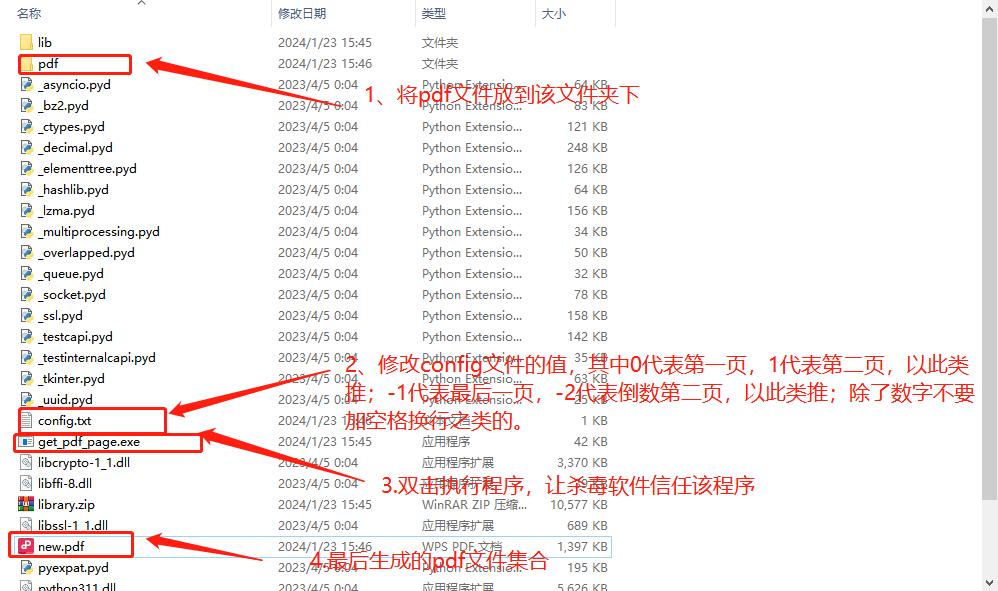

:::tip
在工作的一些场景中，有时需要我们将多个pdf文件中的内容提取出来，比如有10个pdf文件，我们要统一打印pdf文件的第一页或者最后一页...
:::

<!-- more -->

## 需求分析

我们需要批量提取PDF文件中的任意一页，可以是第一页也可以是中间某一页，也可以是最后一页。安装我们操作数组的逻辑，当我们输入整数的时候页面从前开始算，输入负数时页面从后开始算。

如果要提取的某一页不存在，则跳过改文件操作，提取下一个文件。

## 代码实现

这个需求需要使用操作PDF神器`PyPDF2`库，首先安装该管理包

```sh
pip install PyPDF2
```
然后验证该管理包是否安装成功，可以再Python环境文件中import改库，如果没有保持这标识已经安装成功，你可以在项目中使用该库。
```py

# 如果没有报错，表示成功导入 PyPDF2
import PyPDF2

```
这里主要使用`PdfReader`和`PdfWriter`这两个读写Api；

为了方便操作，这里集中将pdf文档都放到一个名为pdf的文件夹中，脚本程序去该文件夹中读取要操作的文件；

另外为了动态读取页面，将要获取的页码写在一个名为config.txt的文件中

具体代码实现

```py
from PyPDF2 import PdfReader, PdfWriter
import glob
 
def split_combine(path, pdf_writer):
    pdf = PdfReader(path)
    print(len(pdf.pages))
    print(path + '\n')
    # lastest page
    filename = "config.txt"
    with open(filename) as file_object:
        count = file_object.read()
        print(count)
    if int(count) <= len(pdf.pages) and int(count) >=0:
        page = pdf.pages[int(count)]
        pdf_writer.add_page(page)
    elif int(count) < 0 and int(count) >= -len(pdf.pages):
        page = pdf.pages[int(count)]
        pdf_writer.add_page(page)
    else:
        print('输入的页码不正确')
 
if __name__ == '__main__':
    # get curren dir pdf files
    pdf_list = glob.glob('pdf/*.pdf')
    pdf_writer = PdfWriter()
    for i, pdf_file in enumerate(pdf_list):
        print(pdf_file)
        split_combine(pdf_file, pdf_writer)
    with open('new.pdf', 'wb') as output_pdf:
        pdf_writer.write(output_pdf)
```

这里说一下`if __name__ == '__main__'` 是什么意思？

>name 是当前模块名，当模块被直接运行时模块名为 main 。这句话的意思就是，当模块被直接运行时，if 以下代码块将被运行，当模块是被导入时，代码块不被运行。

## 将Python脚本生成exe可执行文件
### 安装
这里使用了`py2exe`打包，安装py2exe，使用pip：
```sh
pip install py2exe
```
### 打包Python脚本

这里的Python脚本是get_pdf_page.py，需要创建一个名为setup.py的配置文件，并添加如下代码：
```py
from distutils.core import setup
import py2exe

setup(console=["get_pdf_page.py"])

```
然后，在终端中运行以下命令：
```sh
python setup.py py2exe
```
这将在dist文件夹中生成一个可执行文件。

## 使用



**如果看完觉得有收获，欢迎点赞、评论、分享支持一下。你的支持和肯定，是我坚持写作的动力~**

最后可以关注我@零度杂谈。欢迎[点此扫码关注](https://holazero.cn/wx_code.jpg)交流，共同进步~