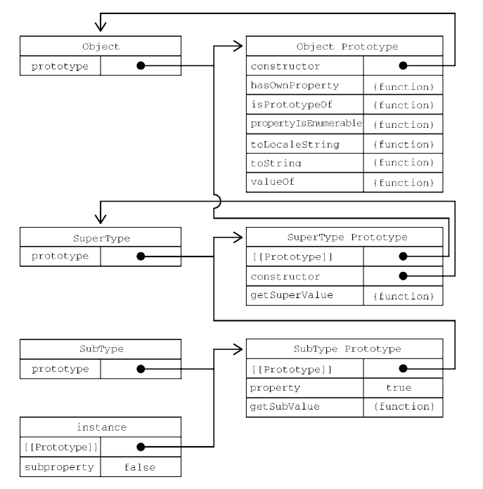

:::tip
`JavaScript`的继承主要是通过原型链实现的，所以理解原型链是掌握`JavaScript`继承的关键一环。原型链的继承的基本思想是通过原型链继承多个引用类型的属性和方法。
:::

<!-- more -->

## 理解原型链

关于原型链的定义与理解：

每个构造函数都有一个原型对象，原型有一个属性指向构造函数，而实例有一个内部指针指向原型。但是如果原型是另外一个类型的实例呢，那么就意味着这个原型本身有一个内部指针指向另外一个原型，相应地另外一个原型也有一个指针指向另一个构造函数。这样实例和原型之间构造了一条原型链。这就是原型链的基本思想构成。

阅读下面的代码，来深入理解原型链：

```js
function SuperType () {
    this.property = true;
}

SuperType.prototype.getSuperValue = function () {
    return this.property;
}

function SubType() {
    this.subproperty = false;
}

// 现在让之类继承父类SuperType

SubType.prototype = new SuperType()

SubType.prototype.getSubValue = function() {
    return this.subproperty;
};

const instance = new SubType();

console.log(instance.getSuperValue());

```
上面代码定义了两个类：父类`SuperType`和子类`SubType`，并且分别定义了一个属性和方法。其中`SubType`是通过创建`SuperType`的实例并将其赋值给自己的原型（`SubType.prototype`）实现了对`SuperType`的继承。这个赋值重写了`SubType`最初的原型，并将其替换为`SuperType`的实例。这就意味着`SuperType`实例可以访问的属性和方法也会存在于`SubType.prototype`。



这个例子中实现继承的关键，是`SubType`没有使用默认原型，而是将其替换成了一个新的对象。这个新的对象恰好是`SuperType`的实例。这样一来，`SubType`的实例不仅能从`SuperType`的实例中继承属性和方法，而且还与`SuperType`的原型挂上了钩。于是`instance`（通过内部的[[Prototype]]）指向`SubType.prototype`，而`SubType.prototype`（作为`SuperType`的实例又通过内部的[[Prototype]]）指向`SuperType.prototype`。注意，`getSuperValue()`方法还在`SuperType.prototype`对象上，而`property`属性则在`SubType.prototype`上。这是因为`getSuperValue()`是一个原型方法，而`property`是一个实例属性。`SubType.prototype`现在是`SuperType`的一个实例，因此`property`才会存储在它上面。还要注意，由于`SubType.prototype`的`constructor`属性被重写为指向`SuperType`，所以`instance.constructor`也指向`SuperType`.

默认情况下，所有引用类型都继承自`Object`，这也是通过原型链实现的。任何函数的默认原型都是一个`Object`的实例，这意味着这个实例有一个内部指针指向`Object.prototype`。这也是为什么自定义类型能够继承包括`toString()`、`valueOf()`在内的所有默认方法的原因。`SubType`继承`SuperType`，而`SuperType`继承`Object`。在调用`instance.toString()`时，实际上调用的是保存在`Object.prototype`上的方法。

我们知道，在读取实例上的属性时，首先会在实例上搜索这个属性。如果没找到，则会继承搜索实例的原型。在通过原型链实现继承之后，搜索就可以继承向上，搜索原型的原型。对前面的例子而言，调用`instance.getSuperValue()`经过了3步搜索：`instance`、`SubType.prototype`和`SuperType.prototype`，最后一步才找到这个方法。对属性和方法的搜索会一直持续到原型链的末端。这就是原型链的向上搜索功能。

## 原型链与继承
原型与实例的关系可以通过两种方式来确定：`instanceof`和`isPrototypeOf`

### instanceof操作符
使用`instanceof`操作符，如果一个实例的原型链中出现过相应的构造函数，则`instanceof`返回`true`。示例如下：
```js
console.log(instance instanceof Object); // true
console.log(instance instanceof SuperType); // true
console.log(instance instanceof SubType); // true 
```
因为`instance`是`Object`、`SuperType`、`SubType`，所以使用`instanceof`操作符返回`true`。
### isPrototypeOf方法
使用`isPrototypeOf()`方法。原型链中的每个原型都可以调用这个方法，如下例所示，只要原型链中包含这个原型，这个方法就返回`true`：
```js
console.log(Object.prototype.isPrototypeOf(instance)); // true
console.log(SuperType.prototype.isPrototypeOf(instance)); // true
console.log(SubType.prototype.isPrototypeOf(instance)); // true 
```
## 原型链继承所面临的问题

### 新增或重新方法的要点

子类可以增加新的方法或者覆盖父类的方法
```js
// 覆盖父类的方法
SubType.prototype.getSuperValue = function() {
  return false;
};
```

需要注意的是，我们应该避免使用以对象字面量方式创建原型方法，在会破坏之前的原型链，因为这相当于重写
了原型链。
```js
function SuperType () {
  this.property = true;
}

SuperType.prototype.getSuperValue = function () {
  return this.property;
}

function SubType() {
  this.subproperty = false;
}

// 现在让之类继承父类SuperType

SubType.prototype = new SuperType()

SubType.prototype = {
  getSubValue() {
    return this.subproperty;
  },
  getOtherMethod() {
    return false;
  }
}
```
在这段代码中，子类的原型在被赋值为`SuperType`的实例后，又被一个对象字面量覆盖了。覆盖后的原型是一个`Object`的实例，而不再是`SuperType`的实例。因此之前的原型链就断了。`SubType`和`SuperType`之间也没有关系了。
### 原型链继承的引用问题

原型链虽然是实现继承的强大工具，但它也有问题。主要问题出现在原型中包含引用值的时候。前面在谈到原型的问题时也提到过，原型中包含的引用值会在所有实例间共享，这也是为什么属性通常会在构造函数中定义而不会定义在原型上的原因。在使用原型实现继承时，原型实际上变成了另一个类型的实例。这意味着原先的实例属性摇身一变成为了原型属性。
```js
function SuperType() {
 this.colors = ["red", "blue", "green"];
}
function SubType() {}
// 继承 SuperType
SubType.prototype = new SuperType();

let instance1 = new SubType();

instance1.colors.push("black");

console.log(instance1.colors); // "red,blue,green,black"

// 因为colors是因为类型，上一个实例instance1修改了属性，进而影响了第二个实例
let instance2 = new SubType();
console.log(instance2.colors); // "red,blue,green,black" 
```