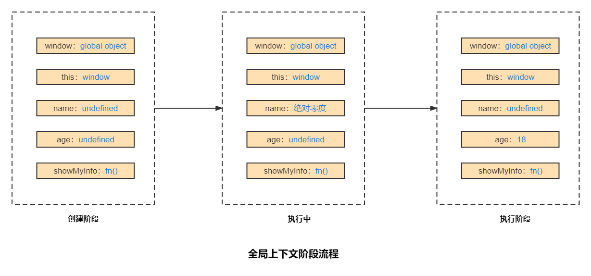

:::tip
在一些在线会议软件、通讯软件中尤其是头一次使用麦克风设备，当电脑中存在多个麦克风设备的时候，往往初始的设备有可能并不是我们想使用的，或者有时候设备故障的时候也需要通过音量的检测来进行判断。我们可以通过音量条的显示来反馈当前设备是否正常工作。
:::

<!-- more -->
# 理解JavaScript的执行上下文

作为一个前端开发者，你必须知道`JavaScript`程序内部是如何执行的，尤其是理解`JavaScript`的执行上下文和执行栈，这对后面理解`JavaScript`中的闭包、作用域链等等有着至关的作用；

## 什么是执行上下文

执行上下文：指当前执行环境中的变量、函数声明，参数（arguments），作用域链，this等信息。

简而言之，执行上下文是评估和执行 `JavaScript` 代码的环境的抽象概念。每当 `Javascript` 代码在运行的时候，它都是在执行上下文中运行。

## 执行上下文的类型

`JavaScript`中有三种执行上下文类型。
可以分为：
- 全局执行上下文
  
  全局执行上下文，在浏览器环境下一般指的是`window`，并且设置`this`的值会指向这个全局的上下文对象，一个程序中只有一个全局上下文。

- 函数执行上下文

  函数被调用时，都会为该函数创建一个新的上下文。每个函数都有它自己的执行上下文，并且该上下文都是在函数函数调用时创建的。

- Eval 函数执行上下文

  由于`Eval`函数一般很少使用，我们这里就不在讨论。

全局与函数执行上下文不同：

- 全局：在文件执行前创建；函数：在函数调用时创建；
- 全局：只创建一次；函数：调用几次创建几次；
- 将`window`作为全局对象；函数：创建参数对象`arguments`，`this`指向调用者；

## 上下文的执行栈

当 `JavaScript` 引擎第一次遇到你的脚本时，它会创建一个全局的执行上下文并且压入当前执行栈。每当引擎遇到一个函数调用，它会为该函数创建一个新的执行上下文并压入栈的顶部。

执行栈会执行位与栈顶的函数，当位于栈顶的函数执行完毕后，就从栈顶弹出该函数（即出栈），然后继续执行下一个位于栈顶的函数，直至执行栈内的函数执行完毕。

理解如下示例代码：

```js
let a = 'Hello World!';

function first() {
  console.log('first 函数上下文');
  second();
  console.log('再次进入 first 函数上下文');
}

function second() {
  console.log('second 函数上下文');
}

first();
console.log('全局上下文');


// first 函数上下文
// second 函数上下文
// 再次进入 first 函数上下文
// 全局上下文

```

上述代码在浏览器引擎执行时

首选创建了一个全局执行上下文，并将全局执行上下文压入当前的执行栈中。

当程序执行遇到`first()`函数调用时，`JavaScript`引擎为该函数创建一个新的执行上下文并把它压入当前执行栈的顶部。

当从 `first()` 函数内部调用 `second()` 函数时，`JavaScript`引擎为 `second()` 函数创建了一个新的执行上下文并把它压入当前执行栈的顶部。

当 `second()` 函数执行完毕，它的执行上下文会从当前栈弹出，并且控制流程到达下一个执行上下文，即 `first()`函数的执行上下文。

当 `first()`执行完毕，它的执行上下文从栈弹出，控制流程到达全局执行上下文。

一旦所有代码执行完毕，`JavaScript`引擎从当前栈中移除全局执行上下文。

## 创建上下文

上下文的创建分为两个阶段：
- 创建阶段
- 执行阶段

### 创建阶段

在JavaScript代码执行前，首选要经历上下文的创建阶段，在创建阶段主要发生以下三件事情：

- 生成变量对象(变量环境)

- 建立作用域链(词法环境)

- 确定this的指向（即this绑定）
```js
ExecutionContext = {
  ThisBinding = '<this value>',
  LexicalEnvironment = {},
  VariableEnvironment = {}
}
```
### 执行阶段

- 变量赋值

- 函数的引用

- 执行其他代码

### 代码示例理解

假如有如下代码：

```js
var name = '绝对零度'
var age = 18
function showMyInfo(){
  return {
      name : name,
      age : age
  }
}
```
现在我们来看在创建阶段和执行阶段分别发生了什么。

首选看一下全局的上执行下文




总体概况，在创建阶段JS引擎将会主要做以下几件事：

- 将`window`作为全局执行上下文对象
- 创建`this`,`this`指向`window`
- 给变量和函数安排内存空间
- 变量赋值`undefined`，函数声明放入内存
- 放入作用域链

在执行阶段则是对变量赋值，如果遇到函数调用，就执行函数，进而进入函数执行上下文的创建与执行阶段。
