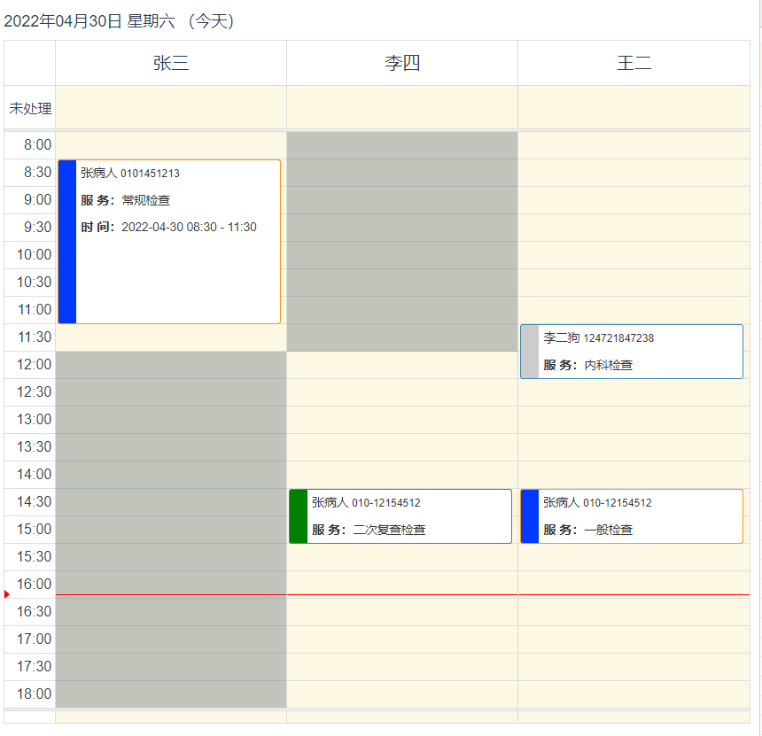
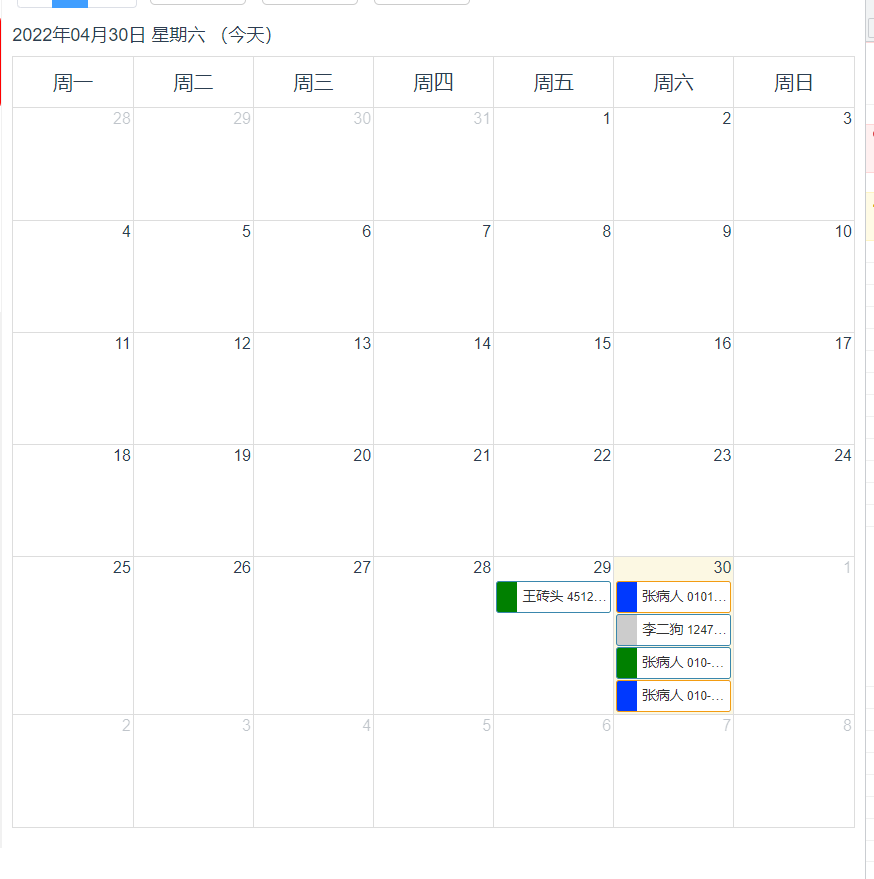

# fullCalendar日程表在Vue项目中的应用


[fullCalendar相关API](https://fullcalendar.io/docs)

[fullCalendar中文版相关API](https://fullcalendar.io/docs)

使用fullCalendar插件在项目中实现日程排版，支持天、月日程转换，自定义事件

## 页面布局

通过按钮切换天与月视图的转换，天视图回显具体的时分排版项目，月视图回显缩略信息

```html
<div class="order-day-calendar h-100 clearfix">
    <div id='calendar' class="h-100" @contextmenu.prevent.stop="stop_default"></div>
    <!-- 右键单击预约信息 -->
    <right-menu ref="menu" :eventsource="menutop">
        <div slot="list">
            <p v-if="!isCurrentDate" @click="arriveModel('arrive')"><i class="iconfont icon-jinrudianpu"></i> 进店登记</p>
            <p @click="lookOrderModel('lookorder')"><i class="iconfont icon-leijiyuyue"></i> 预约详情</p>
            <p v-if="!isShow" @click="showModel('edit')"><i class="iconfont icon-icon-"></i> 修改预约</p>
            <p v-if="!isShow" @click="cancelModel('concel')"><i class="iconfont icon-shanchu"></i> 取消预约</p>
            <p @click="lookInfoModel('lookinfo')"><i class="iconfont icon-chakan"></i> 查看档案</p>
        </div>
    </right-menu>
    <!-- 右键单击可排班区域的回显 -->
    <right-menu ref="menu2" :eventsource="menutop">
        <div slot="list">
            <p @click="addOrder()"><i class="iconfont icon-zengjia"></i> 新增预约</p>
        </div>
    </right-menu>
    <!-- 鼠标滑过预约信息 -->
    <div ref="menu3" v-show="isshowpopover" class="tootips" :style="{top:menulocation.y + 'px',left:menulocation.x + 'px'}">
        <look-order-info :msg="look_msg" :labelWidth="'95px'"></look-order-info>
    </div>
    <!-- 详情信息组件 -->
    <ele-close-order ref="closeorder" :info="item"></ele-close-order>
</div>
```
## 挂在日程组件
日程组件生成需要在dom挂载完毕之后进行，由于`calendar`是有`jq`实现的，所以项目需要配置jq的引用；
```javascript
export default {
    name: 'calendar',
    data () {
        return {
            // 组件变量数据
        }
    }
    mounted(){
        // 初始化日程
        this.InitCalendar()
    },
    methods:{
		// 业务逻辑
    }
}
```
## 模拟数据

```javascript
export default {
    name: 'calendar',
    data () {
        return {
            // 预约人
            orderlists:[
                {
                    emp_adviser: '55',
                    emp_advisername:'张三',
                    status: '1',
                    name: '张病人',
                    bind_phone: '0101451213',
                    date: '2022-04-30',
                    start_time: '08:30',
                    end_time: '11:30',
                    e_serve: '常规检查'
                },
                {
                    emp_adviser: '56',
                    emp_advisername:'李四',
                    status: '2',
                    name: '张病人',
                    bind_phone: '010-12154512',
                    date: '2022-04-30',
                    start_time: '14:30',
                    end_time: '15:30',
                    e_serve: '二次复查检查'
                },
                {
                    emp_adviser: '57',
                    emp_advisername:'王二',
                    status: '3',
                    name: '张病人',
                    bind_phone: '010-12154512',
                    date: '2022-04-30',
                    start_time: '14:30',
                    end_time: '15:30',
                    e_serve: '一般检查'
                },
                {
                    emp_adviser: '57',
                    emp_advisername:'王二',
                    status: '4',
                    name: '李二狗',
                    bind_phone: '124721847238',
                    date: '2022-04-30',
                    start_time: '11:30',
                    end_time: '12:30',
                    e_serve: '内科检查'
                },
                {
                    emp_adviser: '56',
                    emp_advisername:'李四',
                    status: '2',
                    name: '王砖头',
                    bind_phone: '4512441',
                    date: '2022-04-29',
                    start_time: '11:30',
                    end_time: '12:30',
                    e_serve: '内科检查'
                }
            ],
            // 值班人员
            allWorkTime:[
                {
                    date: '2022-04-30',
                    empid: '55',
                    empname: '张三',
                    day: '1'
                },
                {
                    date: '2022-04-30',
                    empid: '56',
                    empname: '李四',
                    day: '2'
                },
                {
                    date: '2022-04-30',
                    empid: '57',
                    empname: '王二',
                    day: '3'
                }
            ],
        }
    }
    mounted(){
        // 初始化日程
        this.InitCalendar()
    },
    methods:{
		InitCalendar(){
			if(this.radio === 'day'){
				this.InitDayCalendar('agendaDay',{resources: this.getResources()});
				//由月切换到天，默认显示选择月的天
				$('#calendar').fullCalendar('gotoDate',this.currentTime);
			} else if (this.radio === 'month'){
				this.InitDayCalendar('month',{})
			}
		},
		// 生成成日表
		InitDayCalendar(type,object){
			const self = this;
			$('#calendar').fullCalendar( 'destroy' )
			const options = MyCalendar.options(type,500);
			$('#calendar').fullCalendar(Object.assign(options,object,{
				eventSources:MyCalendar.eventSources(self.orderlists,self.has_look_contact_auth),
				// 自定义事件逻辑
				}
			));
			// 重新计算日程表的高度
			this.getCalendarHeight();
		},
        // 计算日程表的高度
		getCalendarHeight(){
			try {
				this.timer_g ? clearTimeout(this.timer_g) : '' ;
				this.timer_g = setTimeout(() => {
					let in_h = $('#calendar').height();
					// console.log(in_h);
					$('#calendar').fullCalendar('option', 'height', (in_h - 10));
				}, 100);
			} catch (error) {
				myAlert('获取日程表高度失败！')
			}
		},
    }
}
```
## 实现工具函数

```js
// MyCalendar.js
export default {
  filter: function (options) {
      let { list, rest, temptime, id, other,orderlist} = options;
      // 获取门店id
      const store_id = '55';
      // 先检测是否休店
      for (let i = 0; i < rest.length; i++) {
        const ele = rest[i];
        if (ele.storeid == store_id && ele.date == temptime){
          return [{ id: '休店', title: '今日休店', day: '4'}]
        }
      }
      // 检测是预约列表中是否存在已被预约，但未排班的员工
    let get_c_time_adivers = orderlist.filter(item => item.date == temptime);
    // let get_c_time_adivers = [{ emp_adviser: '55', emp_advisername:'测试用的'}];
      // 不休店，则获取分类
      const arr = []
      list.forEach(item => {
        if (item.date == temptime) {
          // 检查是否存在已预约未排班的员工
          get_c_time_adivers = get_c_time_adivers.filter(order => order.emp_adviser != item.empid);
          other ? arr.push({ id: +item.empid, title: item.empname, day: item.day }) : arr.push(item);
        }
      });
      get_c_time_adivers.forEach(item => {
        other ? arr.push({ id: +item.emp_adviser, title: item.emp_advisername, day: '6' }) : '';
      });
      // console.log(get_c_time_adivers);
      // 合并排班
      for (let i = arr.length - 1; i >= 0; i--) {
        const item = arr[i];
        for (let j = i - 1; j >= 0; j--) {
          const ele = arr[j];
          if (ele[id] === item[id]) {
            ele.day = '3';
            arr.splice(i, 1);
          }
        }
      }
      if(arr.length === 0){
        return [{ id: '未排班', title: '今日未排班', day: '5' }]
      }
      return arr
    },
    // 参数
    options: function (type = 'agendaDay', height = 755){
      return {
        defaultView: type,
        groupByResource: true,
        header: false,
        height: height,
        aspectRatio: 2,
        allDayText: "未处理",            //自定义全天视图的名称
        slotDuration: "00:30:00",      //一格时间槽代表多长时间，默认00:30:00（30分钟）
        slotLabelFormat: "H:mm",    //日期视图左边那一列显示的每一格日期时间格式
        slotLabelInterval: "00:30:00",
        listDayFormat: false,
        listDayAltFormat: false,
        nowIndicator: true,
        minTime: '08:00:00',
        maxTime: '18:30:00',
        displayEventTime: false,
        firstDay: 1,
        editable: false,
        timeFormat: 'H:mm',
        axisFormat: 'H:mm',
      }
    },

    // 事件源
    eventSources: function (list, hasContactAuth){
      // 事件对象
      function getEvents(type) {
        const arr = [];
        list.forEach(item => {
          if (item.status == type) {
            // console.log(item);
            const time = item.date.split('-'),
              start_time = item.start_time.split(':'),
              end_time = item.end_time.split(':');
            let phone = hasContactAuth ? util.getCustomerPhone(item) : util.contact_replace(util.getCustomerPhone(item));
            let obj = {
              id: item.id,
              title: `<div class="clearfix word-task">
                  <ul class="clearfix">
                    <li>${item.name || item.c_name} <span>${phone}</span></li>
                    <li><em>服 务：</em>${item.e_serve || item.serve || '' }</li>
                    <li><em>时 间：</em>${item.date} ${item.start_time} - ${item.end_time}</li>
                  </ul>
                </div>`,
              resourceId: +item.emp_adviser || +item.adviser,
              className: 'status status' + type + '-inner',
              data: item
            };
            if (item.start_time) {
              obj = Object.assign(obj, {
                start: new Date(time[0], time[1] - 1, time[2], start_time[0], start_time[1]),
                end: new Date(time[0], time[1] - 1, time[2], end_time[0], end_time[1]),
                allDay: false,
              })
            } else {
              obj = Object.assign(obj, {
                start: new Date(item.date),
                end: new Date(item.date),
                allDay: true,
              })
            }
            arr.push(obj)
          }
        });
        return arr;
      };
      const arr = [
        {
          events: getEvents(1),
          backgroundColor: '#0039fe',
          color: 'black',
          textColor: '#333',
          borderColor: "#f39c12"
        },
        {
          events: getEvents(2),
          textColor: '#333',
          backgroundColor: 'green',
        },
        {
          events: getEvents(3),
          backgroundColor: '#0039fe',
          textColor: '#333',
          borderColor: "#f39c12"
        },
        {
          events: getEvents(4),
          textColor: '#333',
          backgroundColor: '#ccc',
        },
        {
          events: getEvents(5),
          textColor: '#333',
          backgroundColor: '#ccc',
        }
      ];
      return arr
    }
}

```
效果如下，默认视图为日视图



切换月视图如下：


## 自定义方法及事件

在初始化方法中的配置项中增加以下代码，配置自定义事件回调

```js

dayClick : function( date, e, jsEvent, view ) {
    // console.log(date, view);
    if(!view) return false;
    const clickTime = new Date(date.format()).getHours();
    if(view.day == '1' && +clickTime > 11){
        tipsMsg(self, 'warning', '只能在上午排班！');
        return false
    } else if (view.day == '2' && +clickTime < 12){
        tipsMsg(self, 'warning', '只能在下午排班！');
        return false
    } else if(view.day == '4'){
        tipsMsg(self, 'error', '今日休店！');
        return false
    } else if(view.day == '5'){
        tipsMsg(self, 'error', '今日未排班！');
        return false
    } else if(view.day == '6'){
        tipsMsg(self, 'error', '预约权限已禁止！');
        return false
    }
    const target_ele = e.target;
    // const clickMiunt = new Date(date.format()).getMinutes() === 30 ? '30' : '00';
    // console.log(clickTime,clickMiunt);
    // 显示右键菜单
    self._showMenu(e,'menu2',{date:util.dateToggle('-','-','',date.format()),emp_adviser:view.id});
},
eventRender: function (event, element) {
    element.html(event.title);
},
eventClick : function(data, e, event){
    const temp_data = data.data;
    // console.log(temp_data);
    if(temp_data.status == '5' || temp_data.status == '4'){
        tipsMsg(self, 'error', '该预约已取消！');
        return false ;
    }
    self._showMenu(e,'menu',temp_data);
},
eventMouseover:function(data, e, event){
    console.log(data.data);
    self.look_msg = data.data;
    this.onmousemove = function(e){
        self.too_Tips(e);
    }
},
eventMouseout:function(data, e, event){
    self.outtootips();
},
```
## methods中增加剩余逻辑代码

```js
methods: {
    stop_default(){
        // 阻止默认事件
    },
    _showMenu(e,menu,item){
        this.item = item;
        this.menutop = e;
        this.$refs[menu].isShowMenu = true;
        this.isshowpopover = false;
    },
    showModel(e){
        // console.log(this.item);
        const obj = {isnew:false,orderInfo:this.item,title:'修改预约','weixin':true,'datelock':false,'url':'updatereservation',from:'day'}
        // 业务逻辑
    },
    arriveModel(arrive){
        Event.$emit('comeIn',Object.assign({},this.item,{isnew:false}));
    },
    cancelModel(concel){//取消预约
        this.$refs.closeorder.dialogVisible = true;
    },
    lookOrderModel(){//查看预约信息
        // 业务逻辑
    },
    lookInfoModel(){//查看档案
        // 业务逻辑
    },
    addOrder(){
        // console.log(this.item);
        const obj = {isnew:true,orderInfo:this.item,title:'新增预约','datelock':false,from:'day'}
        // Event.$emit('editOrder',obj);
        tipsMsg(this, 'success', '新增预约成功');
    },
    intootips(){
        clearInterval(this.timer);
        this.timer = setTimeout(() => {
            this.isshowpopover = true;
        }, 100);
    },
    outtootips(){
        clearInterval(this.timer);
        this.timer = setTimeout(() => {
            this.isshowpopover = false;
        }, 100);
    },
    // 获取tootip
    too_Tips(e){
        clearInterval(this.timer);
        this.isshowpopover = true;

        //获取tootip 父元素居body顶部与左侧的距离
        let ele_div = document.getElementsByClassName('order-day-calendar')[0];
        // 获取父级元素的滚动条
        let warp_ele = document.getElementsByClassName('my-data')[0];
        const p = util.getElePoint(ele_div);
        const e_current = e.currentTarget
        const c = util.getElePoint(e_current);
        // 设置tootip的定位
        this.$nextTick(() => {
            let ele = this.$refs.menu3,
                dom_Width = ele.clientWidth,
                dom_Height = ele.clientHeight,
                dom_w = e_current.clientWidth,
                dom_h = e_current.clientHeight,
                client_W = document.body.clientWidth,
                client_H = document.body.clientHeight,
                dom_clientX = e.clientX,
                dom_clientY = e.clientY;
            let scroll = warp_ele.scrollTop;// 滚动条的高度
            let location = {y:dom_clientY - p.t + scroll ,x:dom_clientX - p.l + 20};
            if(dom_clientY + dom_Height > client_H){//如果菜单的高度 + 菜单距浏览器顶部的高度，大于浏览器视口高度
                location.y = location.y - dom_Height - dom_h/2;
            }
            if(dom_clientX + dom_Width > client_W - 50){
                location.x = location.x - dom_Width - 40;
            }
            this.menulocation = location;
            client_W = null;
            client_H = null;
            ele_div = null;
            warp_ele = null;
        });
    }
}
```
## 销毁日程
组件卸载时，需要销毁日程实例
```js
beforeDestory(){
    this.$refs = {};
    $('#calendar').fullCalendar( 'destroy' )
}
```
