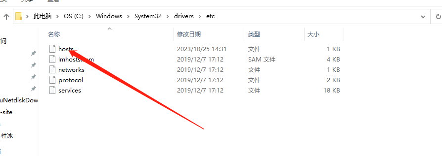
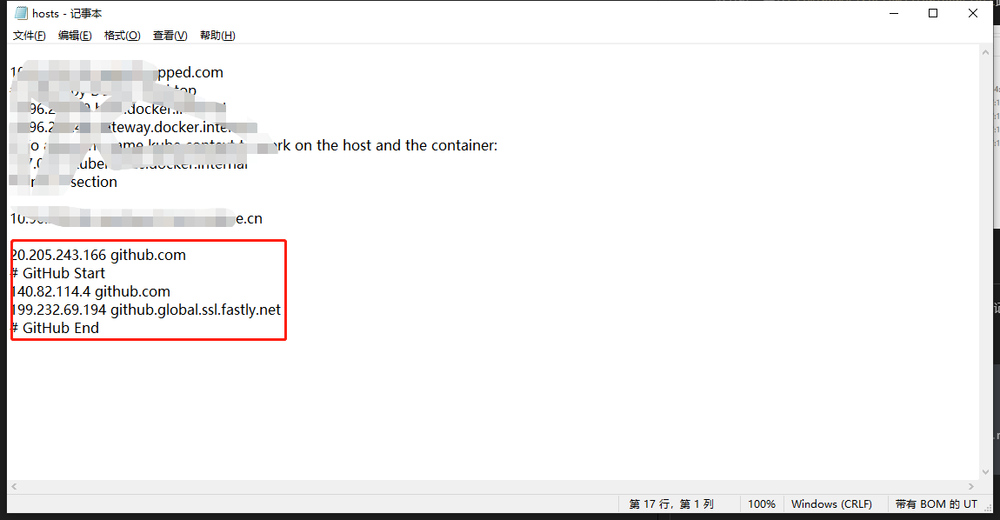
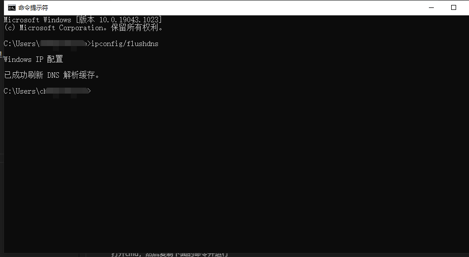

# 解决打不开github页面的问题

我们可以通过修改本地电脑的host来解决这个问题

## 找到本地host文件

该文件一般在`C:\Windows\System32\drivers\etc`此目录下面



## 修改本地host文件

降我们找到的host文件，复制一份到桌面，然后使用记事本的方式打开该文件。

将下面的内容复制到host文件中保存；

```sh
20.205.243.166 github.com
# GitHub Start
140.82.114.4 github.com
199.232.69.194 github.global.ssl.fastly.net
# GitHub End
```



然后将修改后的host文件重新复制一份放到`C:\Windows\System32\drivers\etc`里，并覆盖之前的host文件

## 刷新启动

打开cmd，然后复制下面的命令并运行

```sh
ipconfig/flushdns
```



## 检查是否生效

现在重新打开GitHub页面，发现可以正常访问！！！！！！！