:::tip
编写一个vuepress静态文档项目，并把该项目通过GitHub自动同步到腾讯云的宝塔Linux面板上发布。
:::

<!-- more -->
这里我们主要实现的是vuepress项目的部署与同步，关于vuepress项目的实现这里不进行描述

## 服务器购买
------
### 腾讯云

我们可以直接通过百度搜索`腾讯云`关键字找到[腾讯云的官方](https://cloud.tencent.com/)，然后我们直接注册或者微信扫码登录，然后搜索`轻量应用服务器`，可以先买够一年（购买前先看是否有优惠）。当然也可以在别的云服务器购买服务，比如：阿里云、华为云等等。这里我是购买的腾讯云服务，所以就以腾讯云为案例。

### 服务器部署

创建应用的时候选择`宝塔Linux面板`

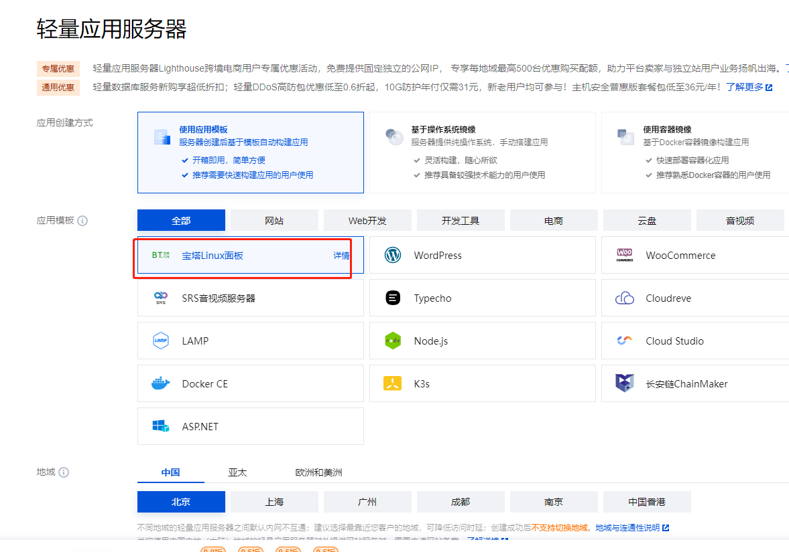

在我们购买万云服务器之后，可以点击右上角的`控制台`进入我们的主页面，然后搜索或点击最近访问列表里的`轻量应用服务器`。

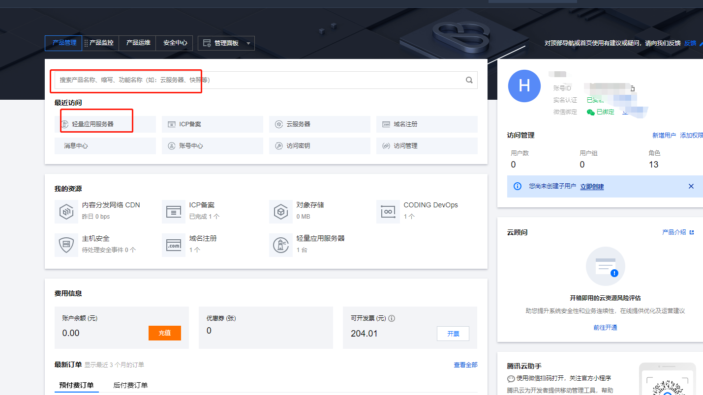


点击轻量应用服务器，就会进入列表页面，点击`更多-详情`则会进入到服务器详情页面。

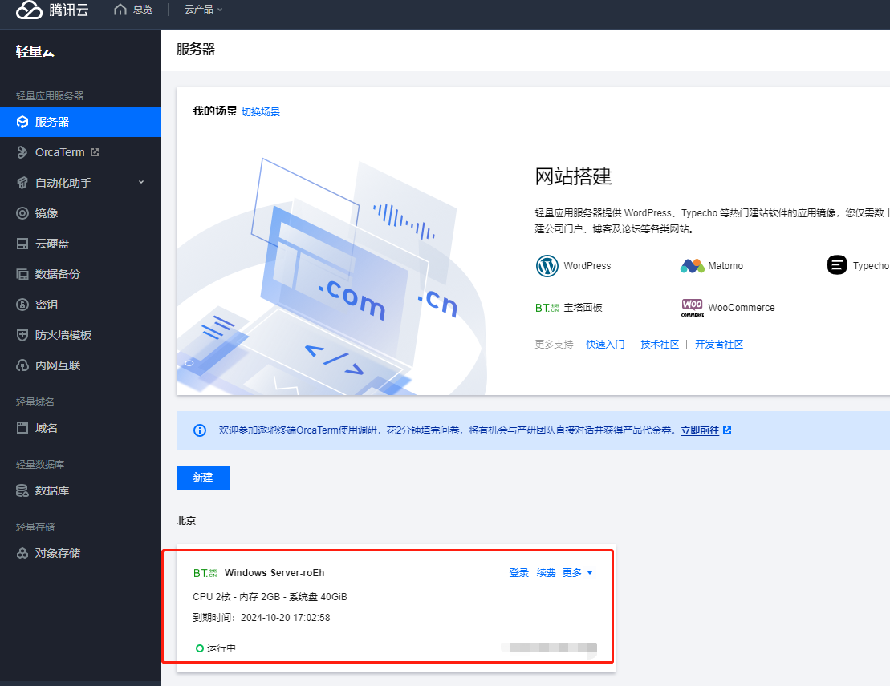

然后需要配置防火墙，点击添加规则分别配置`8888`和`3306`端口，否则打不开宝塔面板，后面的操作也会失败。

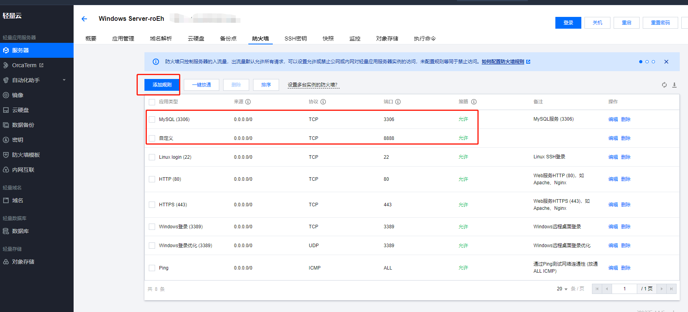

点击应用管理tab，点击登录，会打开新的登录页面

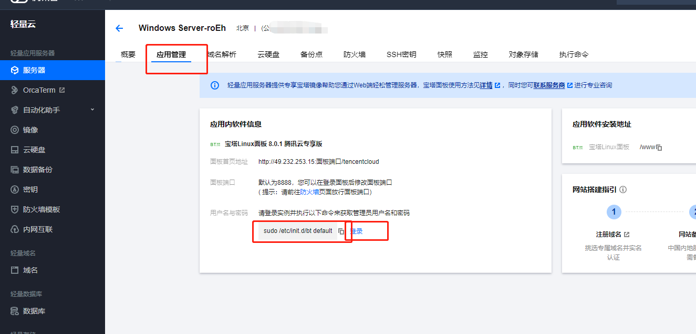

复制命令`sudo /etc/init.d/bt default`，到登录页面运行一下就会内外网登录地址和账户与密码：

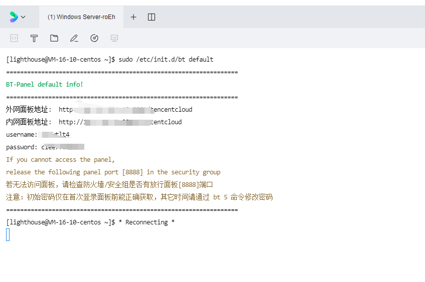

按着键盘`ctrl`键，点击外网面板地址，打开新的登录页面，并将上图中的`username`和`password`复制粘贴到登录页面输入框中点击登录即可进入宝塔系统；

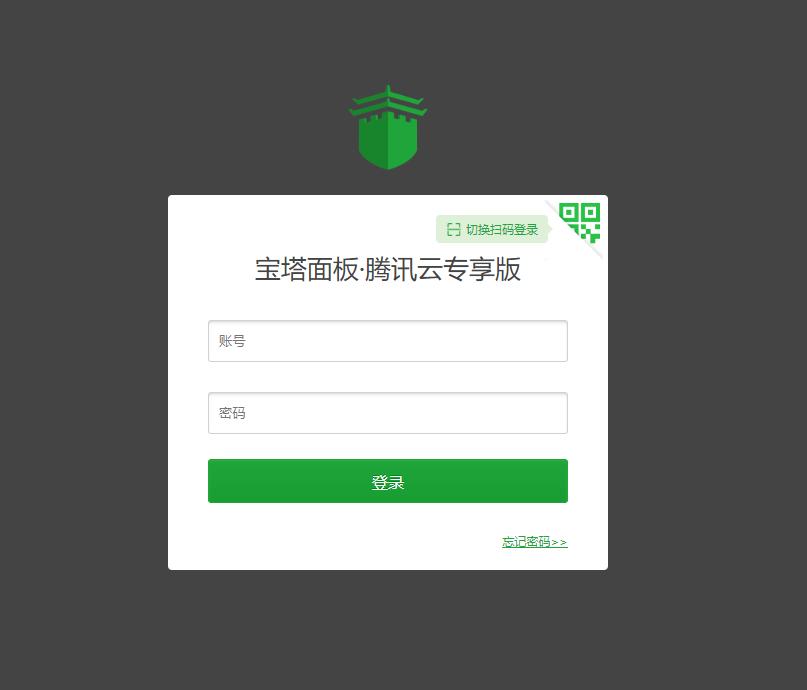

以上就是关于在腾讯云开通轻量级服务器的步骤，下面的工作就是如何在宝塔面板中进行网站配置和自动化更新。

## 宝塔面板
------
### 配置项目域名

登录宝塔面板系统后，首先点击左侧菜单栏的`网站`菜单，然后按照下图进行配置：

`选择PHP项目-添加站点`，在弹框面板中填入`域名`信息，其它项可以使用默认值即可。
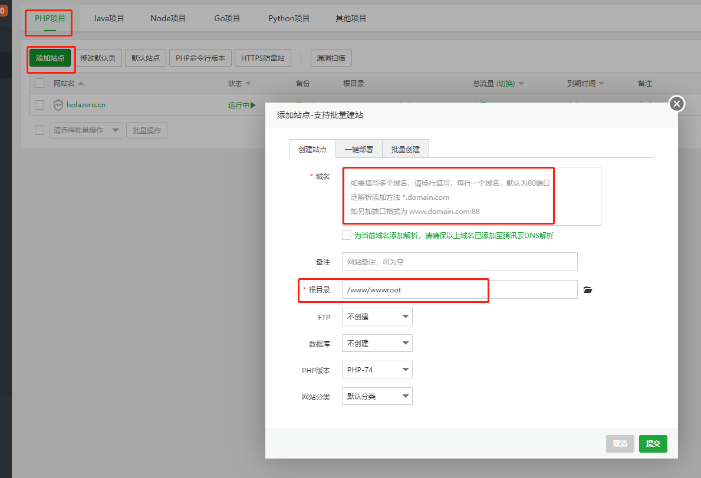

### 上传项目静态资源

点击左侧菜单栏中的`文件`菜单，找到刚才新建项目域名的文件夹，点击`上传`按钮将自己的`vuepress`项目打包后的静态资源上传即可。

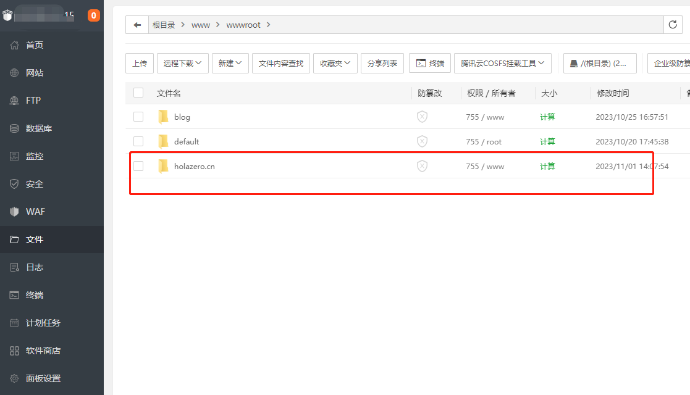

打开浏览器新标签，url栏输入自己项目的域名，如果能正常访问到资源，说明项目初步配置成功；

## GitHub自动化部署
------
通常我们是将自己的项目源代码托管到远程的Github上面，为了避免每次修改项目内容手动上传更新宝塔静态资源，

### 安装宝塔WebHook

点击左侧菜单栏中的`软件商店`菜单，搜索`宝塔WebHook`，安装成功后点击添加hook，打开配置面板，名称可以随意填写，主要是执行脚本。

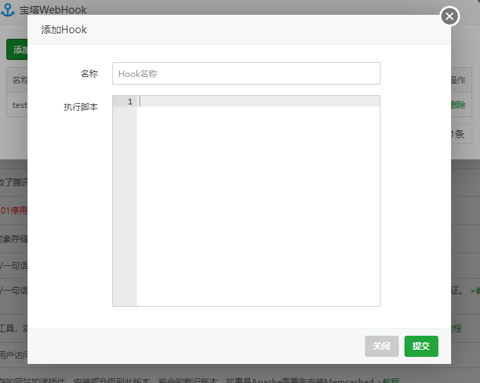

执行脚本示例如下：
```py
#!/bin/bash
echo ""
#输出当前时间
date --date='0 days ago' "+%Y-%m-%d %H:%M:%S"
echo "-------开始-------"
#判断宝塔WebHook参数是否存在
if [ ! -n "$1" ];
then
echo "param参数错误"
echo "End"
exit
fi
#服务器 git 项目路径
gitPath="/www/wwwroot/项目目录名称"
#项目 git 网址
#gitHttp="https://github.com/zhangsan/demo.git"
gitHttp="https://github.com/github账户名称/$1.git"


echo "路径：$gitPath"

#判断项目路径是否存在
if [ -d "$gitPath" ]; then
cd $gitPath
#判断是否存在git目录
if [ ! -d ".git" ]; then
echo "在该目录下克隆 git"
git clone $gitHttp gittemp
mv gittemp/.git .
rm -rf gittemp
fi
#拉取最新的项目文件
git reset --hard origin/master
git pull
#git clean -f
# git pull
echo "拉取完成"
#执行npm
#执行编译
# npm install
# npm run build
#设置目录权限
chown -R www:www $gitPath
echo "-------结束--------"
exit
else
echo "该项目路径不存在"
echo "End"
exit
fi
```
其中上面代码中`$1`参数是从GitHub中的hook配置中带过来的，这里使用的是仓库名称。当然也可以任意定义。

### github中的配置

在GitHub项目配置之前，我们需要查看并拷贝一下`宝塔WebHook`的密匙，点击查看密匙即可拿到密匙。
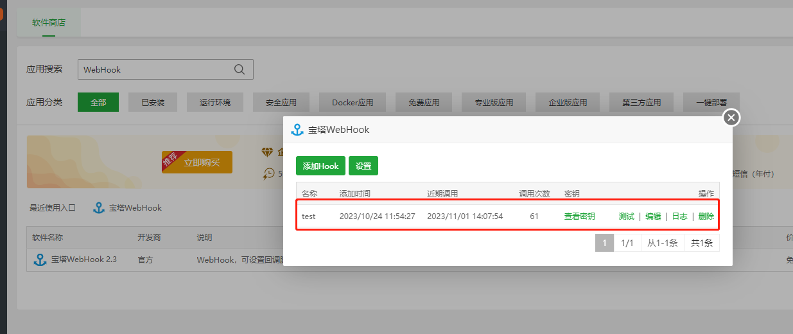

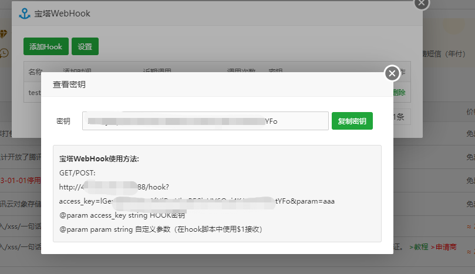

登录GitHub账号，找到我们需要同步的项目，在Settings面板下有个Webhooks功能，我们可以在这里进行配置。

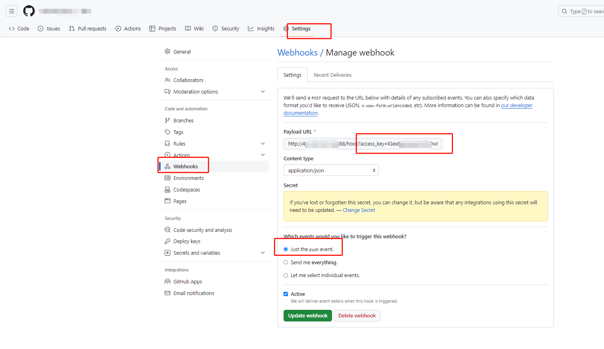

其中`Payload URL`项填入宝塔webhook中的回调地址，即：
```js
GET/POST:
http://你项目的回调地址/hook?access_key=你的密匙&param=你的仓库名称即上面的那个$1
```

`Content type`我们现在使用Json格式传输

`Which events would you like to trigger this webhook?`即触发钩子函数回调的方式，那些事件可以触发同步，可以根据自己的情况配置。

点击创建完成，即可触发一次回调，稍微等几分钟去宝塔面板的`宝塔WebHook`中，点击日志查看是否成功。也可以去文件夹目录看一下文件的更新时间是否为最新时间，如果是则表示自动同步成功。
* * *

**如果看完觉得有收获，欢迎点赞、评论、分享支持一下。你的支持和肯定，是我坚持写作的动力~**

最后可以关注我@零度杂谈。欢迎[点此扫码关注](https://holazero.cn/wx_code.jpg)交流，共同进步~
