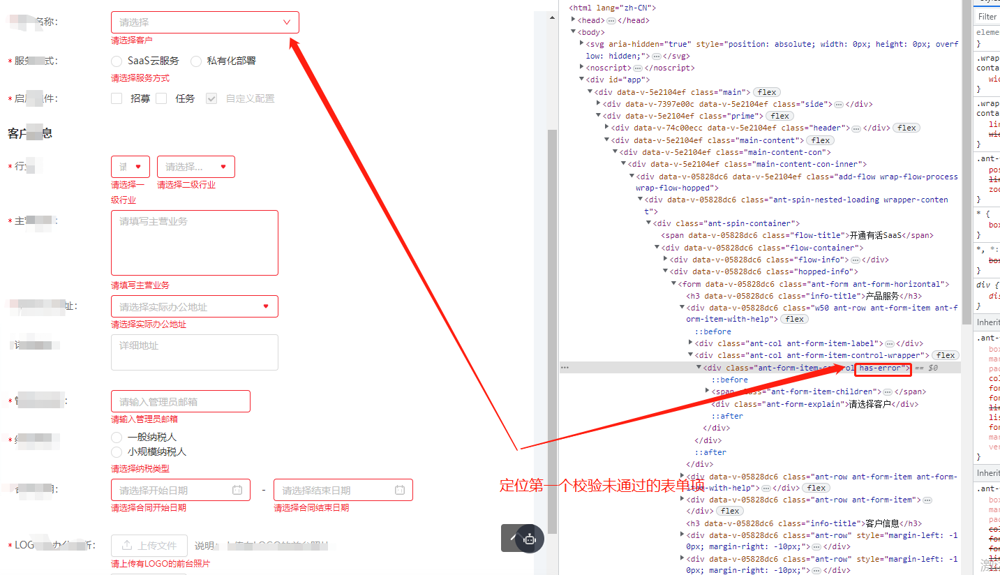

# 快速定位到ant-design form表单校验未通过的item

## 需求背景

在项目开发中，我们经常遇见长长的表单，长到表单写花眼的那种，一屏放不下，滚动条还得往下滚动几下。

当我们提交表单的时候，有的表单项校验未通过，且这个表单项未可视区域，这就会给用户造成一定的困扰，认为提交按钮点击没有反应或者认为系统做的不够人性化。于是就引申出下面的需求，点击提交按钮，未校验通过的表单项如果不在可视区域就滚动到可视区域
## 实现方式
但我们提交表单时，如果检验未通过，这未通过的表单项就会增加一个固定的class类，对该表单项进行标红高亮并显示错误提示语。

我们根据这个规则，找到表单校验未通过的项，然后选定第一个高亮的项，将页面视图滚动到该项处，即可解决这个问题；

代码如下：

```js
submitForm() {
  this.$refs.form.validate((valid) => {
    if (valid) {
      // 校验通过的操作
    } else {
      const isError = document.getElementsByClassName('has-error')
      isError[0] && isError[0].scrollIntoView()
    }
  })
}
```
## 稍加优化

在大型的项目中，有的页面可能会被keep-alive缓存，或者表单页面又有弹框表单，所以为了避免上面的class类选择错误，需要增加选择范围；

我们对代码进行封装：
```js
// uitls.js
// 定位未校验通过的表单位置
export function validErrorInputPosition(domClass, errorClassName) {
  const content = document.querySelector(domClass)
  let isError = content
  if (errorClassName) {
    isError = content.getElementsByClassName(errorClassName)
  }
  isError[0] && isError[0].scrollIntoView()
}
// 业务页面使用

submitForm() {
  this.$refs.form.validate((valid) => {
    if (valid) {
      // 校验通过的操作
    } else {
      // 定位校验未通过的表单项
      validErrorInputPosition('page-class', 'has-error')
    }
  })
}
```

## 效果展示




