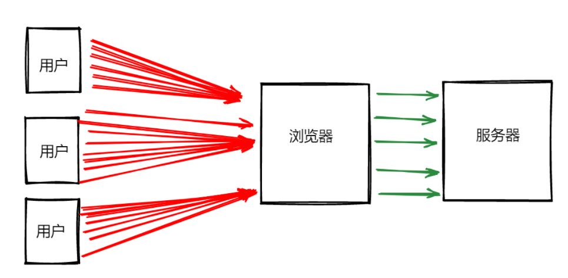

## 把一个 url 拆解成 origin、文件名、hash 拆解成示例的格式

首先需要明白一个 URL 的组成分为几部分，以这个`http://localhost:8080/article/details/109065450/?id=14d76037-6462-445a-8d64-00c6b517db11&openType=new_blank#/client_info/client_info_page`为例

- 协议： 常见的协议有两种，一种是`http://` 一种是`https(http+ssh)://`
- 域名：`localhost`
- 端口： 一般范围在 0-65535 之间，默认端口 http 是 80，https 为 443
- 文件路径：`/article/details/109065450`
- hash：一般以#开头`#/client_info/client_info_page`
- 参数： 一般以?开头以=连接的键值对，多个键值对采用&分割`?id=14d76037-6462-445a-8d64-00c6b517db11&openType=new_blank`

解析一个 URL，这里利用创建一个 a 标签解析

```js
const url =
  "http://localhost:8080/article/details/109065450/?id=14d76037-6462-445a-8d64-00c6b517db11&openType=new_blank#/client_info/client_info_page";
const parse = (path) => {
  let data = {
    path: "",
    query: {},
    origin: "",
    hash: "",
  };
  const tag = window.document.createElement("a");
  tag.href = path;
  data.origin = tag.origin;
  data.hash = tag.hash;
  data.path = tag.pathname;
  let pathList = tag.search.split("?");
  //获取query
  if (pathList[1]) {
    let queryList = pathList[1].split("&");
    queryList.map((item) => {
      let queryData = item.split("=");
      data.query[queryData[0]] = queryData[1];
    });
  }
  return data;
};
console.log(parse(url));
```

最后输出的值

```js
{
  hash: "#/client_info/client_info_page";
  origin: "http://localhost:8080";
  path: "/article/details/109065450/";
  query: {
    id: "14d76037-6462-445a-8d64-00c6b517db11";
    openType: "new_blank";
  }
}
```

## 两个数组合并成一个数组

现在需要将两个数组 arr1 和 arr2 合并成一个新的 newArr

1.es6 的解构

```js
const newArr = [...arr1, ...arr2];
// 该操作会生成一个新的数组，而不改变原来的数组
```

2.使用`concat`方法

```js
const newArr = [];
newArr.concat(arr1, arr2);
```

3.使用`push`或`unshift`方法添加

```js
newArr.push(...arr1);
newArr.push(...arr2);
// 或者
newArr.unshift(...arr1);
newArr.unshift(...arr2);
```

关于算法优化的问题

## 大小驼峰转换

首先需要明白一点小驼峰和大驼峰的概念

- 小驼峰：首单词的首字母小写，其他单词的首字母大写，例如：`className`
- 大驼峰：单词的首字母都大写，例如`ClassName`

### 将下划线转化为小驼峰

```js
function underlineToSmallCamel(str) {
  return str.toLowerCase().replace(/_([a-z])/g, function (s, s1) {
    return s1.toUpperCase();
  });
}
const a = underlineToSmallCamel("class_name_type");
console.log(a);
// classNameType
```

### 将小驼峰转化为下划线

```js
function camelToUnderline(camelStr) {
  return camelStr
    .replace(/[A-Z]/g, function (s) {
      return " " + s.toLowerCase();
    })
    .trim()
    .replaceAll(" ", "_");
}
camelToUnderline("classNameType");
// "class_name_type"
```

### 大小驼峰转换

```js
function camelToUpperCase(str) {
  if (!str) return "";
  return str.replace(/[a-z]/, function (s) {
    return s.toUpperCase();
  });
}
camelToUpperCase("classNameType");
// ClassNameType
```

## 首屏优化的方案

### 代码
- 路由懒加载
- 异步组件
- 按需加载UI库，tree-skaning优化
- 页面使用骨架屏（Skeleton）
### 网络
- 使用CDN加速，将通用库从vendor进行抽离
- 图片懒加载减少占用带宽
- JavaScript代码使用预加载和异步加载（`功能独立且不要求马上执行的js文件可以使用async，优先级低且没有依赖的js，加入defer`）
- 雪碧图
### 缓存
- webpack、vite（打包工具）开启gzip压缩
- Nginx开启Gzip功能
## 前端如何处理高并发问题

如果一次性增加 100 万个用户访问项目，前端角度你会怎么优化

如果一个项目同时被百万以上基本的用户访问，就会涉及到高并发的问题，而前端需要关注的则是如何减少减轻资源请求，以降低对后端服务器的压力。



所以要在前端优化关于高并发的问题，还是优化前端资源的问题，这和前端首屏优化方案有点类似。

- 图片压缩、CSS sprites、小图片base64编码等等。
- 多个文件合并成一个文件，减少http的请求数量
- 静态资源上传cdn
- 设置响应头cache-control和last-modified
- 代码压缩（去空格、去回车、去注释、替换较长变量名称等等）；
- 函数防抖节流应用，减少短时间内高频请求接口，降低api访问次数；

## Property与attribute的区别

在 `JavaScript` 中，`property`和 `attribute`是两个不同的概念，它们的区别如下：

- 属性是 `JavaScript` 对象中的一个键值对，其中键是一个字符串，值可以是任何类型的值，包括其他对象、函数、字符串、数字等。例如，对于一个对象 `obj`，`obj.name` 是一个属性，它的键是 `"name"`，它的值可以是字符串、数字或其他对象等。
- 特性是`HTML`元素的一种附加信息，它是为了描述 `HTML` 元素的状态或特征而添加的。`HTML` 元素的特性可以在标签中使用，也可以在 `JavaScript` 中使用。例如，在 `HTML` 中，`img` 元素有一个 `"src"` 特性，它指定了要显示的图像的 `URL`。在 `JavaScript` 中，可以使用元素的 `"getAttribute" `方法来获取特性的值，例如，`img.getAttribute("src")`。
- `property`和`attribute`之间存在一定的关联，但它们并不总是相等的。在 `HTML` 中，一些特性与属性有相同的名称，例如 `"id"`，`"name"`，`"value"` 等。在这种情况下，它们的值通常是相同的。但是，其他特性和属性之间可能存在差异，例如 `"class"` 特性在 `JavaScript` 中对应的是 `"className"` 属性。
- 在修改 `HTML` 元素的`attribute`时，可能会影响到其对应的`property`，反之亦然。例如，在 `JavaScript` 中使用元素的 `"setAttribute"` 方法可以修改其`attribute`的值，而在 HTML 中修改某些`attribute`的值可能会导致对应的`property`也发生变化。

总之，`property`和`attribute`是两个不同的概念，`property`是 `JavaScript` 对象中的键值对，而`attribute`是 HTML 元素的一种附加信息，它们之间有些关联，但并不总是相等的。

## JavaScript中的this关键字是怎么工作的？
在 JavaScript 中，`this`是一个关键字，用于指向当前执行代码的对象。它的指向是在函数被调用时确定的，在不同的上下文下，`this`的指向是不同的。具体来说，`this`的指向有以下几种情况：

1. 默认绑定：这种情况下，`this`指向全局对象`window`。例如：

   ```js
   function foo() {
     console.log(this.name);
   }
   var name = 'global';
   foo(); // 输出 'global'
   ```

2. 隐式绑定：这种情况下，`this`指向调用函数的对象。例如：

   ```js
   var obj = {
     name: 'object',
     foo: function() {
       console.log(this.name);
     }
   };
   obj.foo(); // 输出 'object'
   ```

3. 显式绑定：这种情况下，通过`call()`或`apply()`方法来指定函数调用时的`this`指向。例如：

   ```js
   function foo() {
     console.log(this.name);
   }
   var obj = {
     name: 'object'
   };
   foo.call(obj); // 输出 'object'
   ```

4. new绑定：这种情况下，`this`指向新创建的对象。例如：

   ```js
   function Person(name) {
     this.name = name;
   }
   var obj = new Person('object');
   console.log(obj.name); // 输出 'object'
   ```

5. 箭头函数：箭头函数的`this`指向定义时所在的词法作用域中的`this`。例如：

   ```js
   var obj = {
     name: 'object',
     foo: () => {
       console.log(this.name);
     }
   };
   obj.foo(); // 输出 'undefined'
   ```

需要注意的是，`this`的指向在函数被调用时确定，因此在创建一个函数时是无法知道它的`this`指向是什么的，这也是`this`关键字容易出现问题的原因之一。在使用`this`时需要特别注意上下文，避免出现意外的错误。

## JavaScript中的ES6模块和CommonJS有什么不同？

ES6模块和CommonJS是两种不同的模块系统。

ES6模块是ECMAScript 6引入的新特性，它采用静态引入方式，使用`import`和`export`关键字来进行模块的导入和导出，可以在代码中任何地方使用，并且支持按需导入，也可以使用命名导出和默认导出来组合导出多个内容。

CommonJS是Node.js中的模块系统，它采用动态引入方式，使用`require()`函数来进行模块的导入，使用`module.exports`来进行模块的导出。它的特点是可以在运行时根据需要导入和导出模块，但是由于是动态引入，所以会有性能和可靠性问题。

ES6模块与CommonJS的区别主要有以下几点：

1. 语法不同：ES6模块使用`import`和`export`关键字来导入和导出模块；而CommonJS使用`require()`函数来导入模块，使用`module.exports`来导出模块。

2. 动态加载：CommonJS模块是动态加载的，即模块在使用时才会加载；而ES6模块是静态加载的，即在代码编译期间就可以确定加载哪些模块，从而提高了性能。

3. 独立性：ES6模块是在全局作用域中执行的，可以独立于其他模块执行，所以具有更好的封装性和复用性；而CommonJS模块是在当前模块作用域中执行的，它的导出可以被其他模块修改，导致代码不可预测。

总的来说，ES6模块是更优秀和先进的模块规范，但由于其缺乏广泛的支持，它还不能完全替代CommonJS，两种模块规范在不同的应用场景下有其各自的优缺点。

## 用递归的思路实现 1 - 100 求和
可以使用递归的方式来实现 1 - 100 求和：

```js
function sum(n) {
  if (n === 1) {
    return 1;
  } else {
    return n + sum(n-1);
  }
}

console.log(sum(100)); // 输出 5050
```

在 `sum()` 函数中，如果传入的数 `n` 等于 1，直接返回 1；否则将 n 加上递归调用 `sum()` 函数并传入 n - 1 的结果，最终会得到 1 + 2 + ... + 100 的和。

## url 访问都发生了什么（详细阐述）

## var string = "小明"，写一个函数实现 string.fn() = "她叫小明"

## TCP 协议三次握手、四次挥手的过程，为什么挥手要 4 次,以及报文是怎么加密和传送的？
### 三次握手

TCP协议中，通信双方在建立连接时需要进行“三次握手”。三次握手的过程如下：

1. 客户端向服务器发送一个SYN标志的数据包，表示请求建立连接（客户端的序列号为x）。
2. 服务器收到该数据包之后，回复一个带有SYN/ACK标志的数据包，表示同意建立连接，并告诉客户端下一次通信的序列号为y，同时将之前客户端发来的序列号x+1作为确认号。
3. 客户端收到服务器回复的数据包之后，再次回复一个带有ACK标志的数据包，表示确认连接建立并告诉服务器下一次通信的序列号为x+1，同时将之前服务器发来的序列号y+1作为确认号。

这样，三次握手完成，连接建立成功。

### 四次挥手

TCP协议中，通信双方在关闭连接时需要进行“四次挥手”。四次挥手的过程如下：

1. 客户端向服务器发送一个FIN标志的数据包，表示请求关闭连接（客户端的序列号为i）。
2. 服务器收到该数据包之后，回复一个带有ACK标志的数据包，告诉客户端已经收到了关闭请求，并确认关闭请求中的序列号。但是服务器可能还有数据需要传输给客户端，因此不同于三次握手的第二步，并没有同时发送FIN标志的数据包，而是先等待所有数据传输完成后再发出。
3. 当服务器需要关闭连接时，会向客户端发送一个FIN标志的数据包，表示可以关闭连接（服务器的序列号为j），同时将之前客户端发来的序列号i+1作为确认号。
4. 客户端收到该数据包之后，回复一个带有ACK标志的数据包，告诉服务器已经收到了关闭请求并确认，同时将之前服务器发来的序列号j+1作为确认号。这样，四次挥手完成，连接关闭。

为什么要进行四次挥手呢？因为在连接关闭过程中，客户端一旦发送FIN标志的数据包请求关闭连接，就不能再发送数据，但是服务器可能还需要向客户端传输数据，因此需要等待所有数据传输完成再发送FIN标志的数据包表示可以关闭连接。

### 报文的加密和传送

在TCP协议中，数据报文是以明文形式发送的，没有加密。如果需要保证数据安全，可以使用SSL/TLS等安全协议进行加密通信。具体来说，SSL/TLS协议主要有以下几个步骤：

1. 客户端向服务器发送一个加密请求，请求加密通信。
2. 服务器返回一个数字证书，客户端根据该证书验证服务器的身份，并生成一个用于加密数据的密钥。
3. 双方使用该密钥进行加密通信，确保数据安全。

对于报文的传送，TCP协议使用了数据分段和带序列号的确认机制来保证数据的完整性和可靠性。具体来说，TCP将传输的数据按MTU（最大传输单元）大小进行分段，并为每个数据段添加一个序列号和确认号，每次发送数据时都需要等待对方的确认，如果超时未收到确认，就重发该数据段。这样可以保证数据的可靠传输。


## 你们现在整个登录鉴权是怎么设计的？如果要考虑单点登录呢，会如何设计？

我们公司的鉴权系统是基于OAuth 2.0协议的。当用户首次登录时，客户端会将用户的用户名和密码发送到服务器，服务器在验证通过之后，会生成一个access_token并返回给客户端。客户端在后续的请求中需要携带这个access_token，以证明自己的身份。

如果要考虑单点登录，我们可以增加一个单点登录认证服务器，用于认证用户的身份，并生成一个单点登录token，该token可以在多个应用之间共享。具体流程如下：

1. 用户通过客户端向单点登录认证服务器发送登录请求。

2. 认证服务器验证用户的身份，并生成一个单点登录token，将该token返回给客户端。

3. 客户端携带单点登录token向应用服务器发送请求，应用服务器将该token发送到单点登录认证服务器进行验证。

4. 认证服务器验证单点登录token的有效性，如果有效则返回一个access_token给应用服务器，应用服务器根据该access_token确定用户的身份并返回相应的数据。

在这个过程中，单点登录认证服务器起到了统一认证的作用，各个应用服务器可以共享认证信息。如果用户在单点登录认证服务器上的登录状态失效，那么所有依赖于该认证服务器的应用都会被强制下线。

要实现单点登录，需要考虑以下几个方面的设计：

1. 单点登录认证服务器的设计：单点登录认证服务器需要支持用户的注册、登录和token生成等功能，可以选择使用现成的框架实现，例如Spring Security等 。

2. 应用服务器的集成：应用服务器需要通过用户的access_token去单点登录认证服务器请求验证，需要进行认证接口的集成。

3. token的安全性：单点登录token需要遵守安全的设计原则，包括加密、防重放攻击、定期更换等。

4. 用户体验：单点登录需要考虑用户的体验，例如如何处理单点登录服务器统一登录后跳转到不同应用的问题。

综上所述，单点登录是一个比较复杂的系统，需要充分考虑各种情况下的安全性、稳定性和用户体验。在实现单点登录时，需要根据具体场景的需求进行设计，并进行充分的测试和验证。

## 前端页面无感刷新 token 的技术方案？

前端页面无感刷新 token，其实就是在用户登录后，用户的身份凭证（access_token）在一定时间内过期，过期后需要重新获取。为了不影响用户的使用，需要在过期时间内自动刷新token，这就需要用到无感刷新的技术方案。

一般来讲，有以下两种技术方案：

1. 利用定时器定时刷新 token：在获取到用户身份凭证后，可以记录下它的到期时间，然后在到期时间前利用定时器定时刷新 token。具体来说，可以在获取到 token 后，计算出 token 的到期时间，然后利用定时器每隔一定时间做一次 token 到期时间的判断，若已到期，则自动刷新 token。

2. 利用拦截器进行拦截和刷新：这种方法相对来说更为灵活，可以在每次请求前，利用拦截器或中间件进行 token 的检查和刷新。当 token 过期时，拦截器或中间件会将请求自动转到 token 刷新接口，获取到新的 token 后再将请求发送出去。

无论使用哪种方案，都需要对刷新 token 的频率和流量进行合理控制，避免因反复刷新 token 导致请求频率过高或网络流量激增。同时也需要考虑到 token 刷新过程中出现的异常情况，例如网络异常、token 刷新失败等，需要有合适的处理机制，确保系统稳定可靠。

需要注意的是，无感刷新 token 操作是在前端进行的，因此也需要考虑到 token 安全性问题，防止 token 被恶意攻击者窃取或利用。最好的方式是将 token 保存在 HttpOnly 的 Cookie 中，防止前端脚本进行读取，并使用 HTTPS 协议加密数据传输。
## 浏览器的重排重绘了解嘛，一般在写页面的时候会有哪些考虑？

浏览器的重排（reflow）和重绘（repaint）是浏览器对 DOM 及其样式进行重新计算和绘制的过程。

重排通常发生在 DOM 节点的增删、位置移动、尺寸改变、内容修改等情况下，会使浏览器重新计算 DOM 节点的位置和大小，进而影响到其他元素的位置和大小，这样就会引起更多的重排和重绘，影响页面性能；而重绘是在 DOM 或样式变化时，浏览器会根据新的属性值重新绘制元素的外观，这个过程比重排开销更小。

在写页面时，需要考虑如何减少重排和重绘，从而提升页面性能，具体的优化策略如下：

1. 避免频繁操作 DOM：减少 DOM 节点的增删、修改、移动等操作，合理控制刷新的频率，可以使用 documentFragment 等方式尽可能减少 DOM 操作带来的性能影响。

2. CSS 样式表优化：减少使用样式表浮动、绝对定位、文本重排等操作；使用 translate 替代 left 和 top 等属性进行位置移动；选择合适的绝对定位方式等。

3. 图片优化：对于经常变化的图片，可以采用 CSS sprites 技术实现多个图片合成在一张图片中，减少 HTTP 请求次数。同时，可以使用 WebP 格式替代 JPG 或 PNG 等图片格式。

4. 启用 GPU 加速：启用 GPU 加速可以使得浏览器在屏幕上绘制图像时更快，但也需要注意不要将太多元素启用 GPU 加速，以免引起性能问题。

5. 避免 JS 阻塞：JS 是单线程执行的，如果 JS 的执行时间过长，会阻塞其它的操作，导致页面响应变慢。可以使用异步加载和延迟加载等技术减少 JS 阻塞。

总之，在写页面时，应该尽量避免频繁地操作 DOM，减少样式表和图片对页面性能的影响，合理启用 GPU 加速，避免 JS 阻塞，从而实现页面性能的优化。
## 内存泄漏和内存溢出有什么区别

内存泄漏（Memory Leak）和内存溢出（Memory Overflow）都是内存管理中的问题，但是它们的本质是不同的。

内存泄漏指的是程序中已经用完的内存没有被及时地回收释放，导致程序占用的内存越来越大，最后达到一定限制之后会崩溃或死机。原因通常是由于程序中存在一些不需要的引用或指针没有被及时地释放，或者是内存管理器本身的实现有缺陷。

而内存溢出则是指程序申请的内存超出了系统所能分配的范围，导致程序运行失败或崩溃。从本质上讲，内存溢出是一种系统性的问题，它是由于系统可用内存不足，导致无法分配所需要的内存而出现的问题。

在实际开发过程中，开发人员需要时刻关注内存的使用情况，确保程序正常运行。对于内存泄漏问题，需要注意程序中的指针使用和内存释放等问题，及时查找和修复潜在的内存泄漏。对于内存溢出问题，则需要考虑优化算法或者增加内存，以保证程序运行正常。
