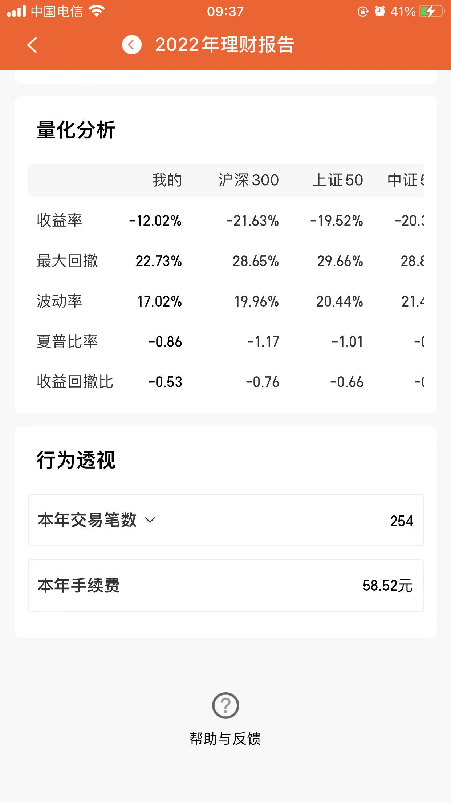
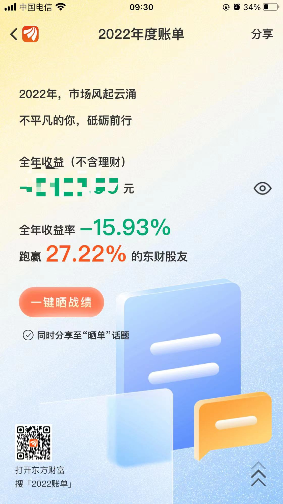
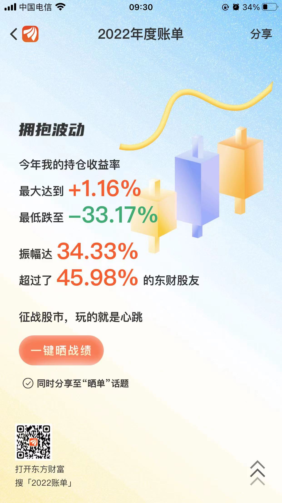

# 回顾2022

这篇文章写的有点晚，但也不算晚，晚是因为2023年已经开始了几天，不算晚是还没有过年。

## 新生
2022年元旦最大的礼物就是宝宝的诞生吧，这条线也贯穿了整个2022年，前几天刚刚过了一周岁的生日，健健康康、平平安安就是最大的愿望；
## 居家办公

这一年BJ的疫情整体分了两波，一是4-5月的时候。本来五一的时候计划回老家，在放假的前几天病毒席卷而来，因为公司在城市东边的区域，整个五月份都在居家办公，还好小区可以正常下楼活动，也可以正常出入小区购买生活用品，这点BJ做的不错，没有一刀切；

第二次是在11月12月的时候，又经历了几天的居家办公，再后来就是阳了，全家老少都没躲过第一波次，在家趟了几天才恢复战斗力；

## 就业形势

### 大环境
去年整体的就业形势都不太好，大环境不好大家都是心知肚明的。时不时的这个大厂裁员那个大厂裁员，搞的人心惶惶。

### 自己的形势
再来说一说我们公司，我们公司经历了2波次裁员，整体减员近千人；

- 第一波是在三月四月份的时候，好多部门、业务线被整体砍掉，因为我们的业务线还算可以，所以占时没有遭受冲击；
- 第二波次是元旦前的12月份，因为业绩一直没有起色，我们业务线开始裁员，研发人员裁掉了近40%左右。

走的人也不算沮丧，留下的人也不算高兴（包含我），因为大家知道，走还有赔偿，留基本上没有年终了，要过一个贫困年；

其实大家也都知道，形势不好，企业也难、老板也难、员工也难；大家还是要彼此相互理解吧！！！！！！！

## 关于技术

这一年总体都是在做项目的迭代，技术上没有太多的更新，基本还是围绕着`Vue2`、`Vue3`以及相关的配套技术栈；

对了另外说一下小程序的框架--`uni-app`这个框架，2季度的时候使用这个框架做了一款小程序，相关前端开发人员对这款小程序的内置配套组件吐槽甚多，整体效果不好，坑太多；

另外就是读了一下书籍：

- Vue.js设计与实现
- TypeScript入门与实战
- 前端技术架构与工程
- 前端工程化：体系设计与实践
- 前端架构：从入门到微前端
- 中国城市大洗牌
- 结构性改革
- 牛棚杂忆
## 关于理财
2022年是理财的大坑之年，不论什么时候买，小散们基本上都是亏的；股票下跌、基金下跌、就连银行的理财产品也没跑掉下跌的命运，更有某某村镇银行暴雷，真是理财的路上处处是坑，正所谓你不理财，财不坑你。

### 理财产品
理财产品的投资主要是在ZS银行、腾讯的WZ银行，按照宣传的利率是年化`3%-4%`左右，上半年还好，下半年过了十一，理财产品开始大跌，短短半个月跌回了半年多的利润。
### 股票与基金
基金是赔了整个2022年度

## 新年希望

- 希望家人平平安安、健健康康、家庭和睦；
- 工作顺利（最好能涨点薪）、也希望公司能好起来不管年后在不在这里；
- 关于技术就是再看基本书，温习一下之前看过的书；
- 希望基金和股票能回本，哈哈，最好有点盈利；
- 希望疫情病毒消失吧，大家回归正常生活；