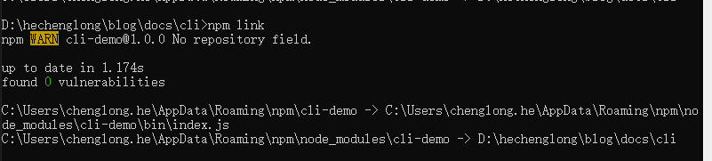

# 创建cli

## 创建文件
创建新的项目文件夹
```sh
$ mkdir cli # 创建项目文件夹
$ cd cli # 进入文件夹
$ npm init # 初始化项目生成package.json文件
```
## 初始化项目
生成的`package.json`文件如下
```json
{
  "name": "cli-demo",
  "version": "1.0.0",
  "description": "开发个人cli工具脚手架",
  "main": "index.js",
  "scripts": {
    "test": "echo \"Error: no test specified\" && exit 1"
  },
  "keywords": [
    "cli",
    "脚手架"
  ],
  "author": "绝对零度",
  "license": "ISC"
}
```
### 创建执行文件

```sh
$ mkdir bin # 创建bin文件夹
$ cd bin # 进入文件夹
$ type null > index.js # 穿件执行文件
$ cd ./../
$ mkdir template # 创建模版文件目录
$ cd template
$ cd .> index.html # 穿建模板文件
```
修改`package.json`文件，增加以下代码：
```json
"main": "./bin/index.js",
"bin": "./bin/index.js",
```
### 测试index.js文件
给`index.js`文件增加
```js
#! /usr/bin/env node
console.log('test link is successed')
```
关于这句话的意思：

>在写npm包的时候需要在脚本的第一行写上`#!/usr/bin/env node` ，用于指明该脚本文件要使用node来执行。
>`/usr/bin/env` 用来告诉用户到`path`目录下去寻找`node`，`#!/usr/bin/env node`可以让系统动态的去查找`node`，已解决不同机器不同用户设置不一致问题。

>PS： 该命令必须放在第一行， 否者不会生效
### 链接到全局
在cmd中执行`npm link`命令



执行成功后，然后测试命令是否生效
```sh
# 执行
$ cli-demo
```
结果输出
```sh
index.js
```
说明`link`成功！！