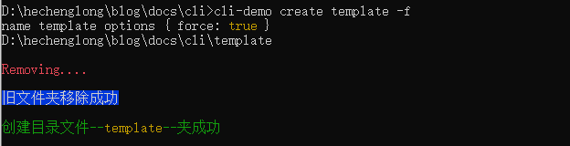

# 创建 cli

## 创建文件

创建新的项目文件夹

```sh
$ mkdir cli # 创建项目文件夹
$ cd cli # 进入文件夹
$ npm init # 初始化项目生成package.json文件
```

## 初始化项目

生成的`package.json`文件如下

```json
{
  "name": "cli-demo",
  "version": "1.0.0",
  "description": "开发个人cli工具脚手架",
  "main": "index.js",
  "scripts": {
    "test": "echo \"Error: no test specified\" && exit 1"
  },
  "keywords": ["cli", "脚手架"],
  "author": "绝对零度",
  "license": "ISC"
}
```

### 创建执行文件

```sh
$ mkdir bin # 创建bin文件夹
$ cd bin # 进入文件夹
$ type null > index.js # 穿件执行文件
$ cd ./../
$ mkdir template # 创建模版文件目录
$ cd template
$ cd .> index.html # 穿建模板文件
```

修改`package.json`文件，增加以下代码：

```json
"main": "./bin/index.js",
"bin": "./bin/index.js",
```

### 测试 index.js 文件

给`index.js`文件增加

```js
#! /usr/bin/env node
console.log("test link is successed");
```

关于这句话的意思：

> 在写 npm 包的时候需要在脚本的第一行写上`#!/usr/bin/env node` ，用于指明该脚本文件要使用 node 来执行。
> `/usr/bin/env` 用来告诉用户到`path`目录下去寻找`node`，`#!/usr/bin/env node`可以让系统动态的去查找`node`，已解决不同机器不同用户设置不一致问题。

> PS： 该命令必须放在第一行， 否者不会生效

### 链接到全局

在 cmd 中执行`npm link`命令


执行成功后，然后测试命令是否生效

```sh
# 执行
$ cli-demo
```

结果输出

```sh
index.js
```

说明`link`成功！！

## 常用工具

### 说明

一个脚手架的搭建，需要很多额外的工具库，比如命令行指令的`commander`，命令问答的` inquirer`等等，本次重点介绍一些常用的 node 工具库：

| 序号 | 库名        | 主要作用            |
| ---- | ----------- | ------------------- |
| 1    | `commander` | `node.js`命令行工具 |
| 2    | `inquirer`  | 命令行交互工具      |

### `commander`使用

安装`commander`工具，相关 Api 中文文档请移至>>>[这里](https://github.com/tj/commander.js/blob/master/Readme_zh-CN.md)

或者请移步>>>[这里](https://blog.csdn.net/cheng521521/article/details/125188568)

```sh
npm install commander
```

安装成功 package.json 增加以下信息

```json
"dependencies": {
    "commander": "^9.3.0"
}
```

#### 测试`commander`命令

现在在`bin/index.js`文件中增加如下代码：

```js
const { program } = require("commander");

program
  .command("create <my-app>")
  .description("create a new project")
  .option("-f, --force", "overwrite target directory if it exist")
  .action((name, options) => {
    // 打印执行结果
    console.log("name", name, "options", options);
    // require('../bin/create.js')(name, options)
  });
program.parse();
```

运行测试一下，看是否能正常使用，可以直接使用`node`命令执行`index.js`文件，或者使用前面配置的全局命令`cli-demo`来执行。

`create`为`Command`的命令，后面跟随的`cli-demo`为`<my-app>`实际参数，`-f`是`option`指令

```sh
$ node index.js  create cli-demo -f
# or
$ cli-demo create cli-demo -f
# 打印出结果
# name cli-demo options { force: true }
```

当使用`-h`时，则会显示帮助信息

```sh
Usage: index [options] [command]

Options:
  -h, --help                 display help for command

Commands:
  create [options] <my-app>  create a new project
  help [command]             display help for command
```

### 命令行交互工具`inquirer`使用

命令行交互工具在脚手架开发中占有很重要的地位，主要使用在对用户的询问与选择，执行一些命令

安装`inquirer`工具，相关 Api 文档请移至>>>[这里](https://github.com/SBoudrias/Inquirer.js#readme)

本例中`inquirer`主要是用于列表选择等问答。

为了代码更好封装，我们将创建文件夹的相关逻辑单独抽离出来，创建 create.js 文件,并增加以下代码

```js
#! /usr/bin/env node
const inquirer = require("inquirer");

inquirer
  .prompt([
    {
      name: "action",
      type: "list",
      message:
        "The target folder already exists, Please select the action below",
      choices: [
        {
          name: "Overwrite",
          value: "overwrite",
        },
        {
          name: "Cancel",
          value: false,
        },
      ],
    },
  ])
  .then((answers) => {
    // 交互输出的结果值
    console.log(answers);
    if (answers.action === "overwrite") {
      console.log("重写目标文件夹");
    } else {
      console.log("取消，结束操作");
    }
  })
  .catch((error) => {
    if (error.isTtyError) {
      // Prompt couldn't be rendered in the current environment
    } else {
      // Something else went wrong
    }
  });
```

运行一下试试，看看能否正常进行命令交互

```sh
$ node .\index.js
? The target folder already exists, Please select the action below (Use arrow keys)
> Overwrite
  Cancel
```

键盘上下键作为选择键，enter 作为选择确认键，现在直接按下 enter

```sh
? The target folder already exists, Please select the action below Overwrite
# { action: 'overwrite' }
# 重写目标文件夹
```

`inquirer`返回的是一个`promise`，所以，我们可以使用`async` `await` 代替

### 创建本地文件夹

在创建本地文件夹之前，我们需要先判断本地是否已经存在此文件夹，如果存在则需要告知用户是否删除或覆盖文件夹。另外可以根据用户的创建命令，直接强制创建文件夹(`-f --force`)；

所以我们需要用到`node`的`fs.existsSync`:

> 以同步的方法检测目录是否存在。如果目录存在 返回 true ，如果目录不存在 返回 false

删除文件夹则需要使用 fs 的拓展工具[`fs-extra`](https://www.npmjs.com/package/fs-extra)中的`fs.remove(targetPath)`方法,需要安装一下`npm install fs-extra`;

完善一下代码：

```js
const path = require("path");
const fs = require("fs-extra");
const inquirer = require("inquirer");
module.exports = async function (name, options) {
  const cwd = process.cwd();
  const targetPath = path.join(cwd, name);
  console.log(targetPath);
  // 判断目标是否存在
  if (fs.existsSync(targetPath)) {
    // 是否强制创建目录
    if (options.force) {
      // 移除旧目录
      console.log(`\r\nRemoving....`);
      // await fs.remove(targetPath)
    } else {
      // 是否要覆盖目录
      let { action } = await inquirer.prompt([
        {
          name: "action",
          type: "list",
          message:
            "The target folder already exists, Please select the action belowcls",
          choices: [
            {
              name: "Overwrite",
              value: "overwrite",
            },
            {
              name: "Cancel",
              value: false,
            },
          ],
        },
      ]);
      if (!action) {
        return;
      } else if (action === "overwrite") {
        // 如果选择重写目录
        console.log(`\r\nRemoving....`);
        // await fs.remove(targetPath)
      }
    }
  }
  // 创建目录
  fs.mkdir(targetPath, (err) => {
    if (!err) {
      console.log("创建目录文件夹成功");
    }
  });
};
```

例如我们需要创建一个名为`template`的模版文件夹,且本地存在`template`文件夹

```sh
$ ****\cli>cli-demo create template
index.js
name template options {}
$ ****\cli\template
? The target folder already exists, Please select the action belowcls (Use arrow keys)
> Overwrite
  Cancel
# 按下enter键则输出

Removing....
创建目录文件夹成功
```

此时，逻辑代码完全按照预想的预案执行

### 美化信息

安装插件[`chalk`](https://www.npmjs.com/package/chalk)

```sh
$ npm install chalk
```

安装成功后，这个地方发现一个坑需要填平。因为前面的代码我们都是采用`CommonJs`规范，例如采用`require`的方式引入插件`const inquirer = require("inquirer");`，但是新版的`chalk`已经不支持这种方式，需要采用`module`模式，所以需要先修改`package.json`,增加以下配置

```json
"type": "module"
```

然后将项目中相关引用改为`import from `方式,例如：

```js
import { Command } from "commander";
import { create } from "./create.js";
// 其它代码省略
```

言归正传，我们接着使用`chalk`来美化命名输入样式

```js
import chalk from "chalk";
export async function create(name, options) {
  const cwd = process.cwd();
  const targetPath = path.join(cwd, name);
  console.log(targetPath);
  // 判断目标是否存在
  if (fs.existsSync(targetPath)) {
    // 是否强制创建目录
    if (options.force) {
      // 移除旧目录
      console.log(chalk.redBright(`\r\nRemoving....`));
      await fs.remove(targetPath);
      console.log(chalk.bgBlue(`\r\n旧文件夹移除成功`));
    } else {
      // 原始逻辑
      if (!action) {
        return;
      } else if (action === "overwrite") {
        // 如果选择重写目录
        console.log(chalk.redBright(`\r\nRemoving....`));
        await fs.remove(targetPath);
        console.log(chalk.bgBlue(`\r\n旧文件夹移除成功`));
      }
    }
  }
  // 创建目录
  fs.mkdir(targetPath, (err) => {
    if (!err) {
      console.log(
        chalk.green(`\r\n创建目录文件--${chalk.yellow(name)}--夹成功`)
      );
    }
  });
}
```
再次执行命令`cli-demo create template -f`，此处输出：



这样命令行消息就显得醒目一些，更加方便查看。

