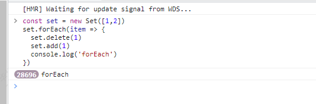

## forEach遍历访问set造成的无限循环问题

### 抛出问题

先给出一段代码，我们创建了一个集合`set`，它里面有一个元素数字1和2，接着我们调用`forEach`方法来遍历该集合。在遍历函数中，首先调用`delete`方法删除数字`1`，再执行了某些业务操作后紧接着调用`add`方法将数字`1`加回，最后打印 `'forEach'`。如果我们在浏览器中执行这段代码，就会发现它会无限执行下去。

```js
const set = new Set([1,2])
set.forEach(item => {
  set.delete(1)
	// 这里执行了某些操作
  set.add(1)
  console.log('forEach')
})
```
在控制台执行一下，效果如下：



### 解释一下原因

用官方的原话是这样说的：[官方地址](https://developer.mozilla.org/zh-CN/docs/Web/JavaScript/Reference/Global_Objects/Set/forEach)
>每个值都访问一次，除非在 `forEach()` 完成之前删除并重新添加它。在访问之前删除的值不会调用 `callback`。在 `forEach()` 完成之前添加的新值将被访问。

翻译成白话就是在`forEach`中遍历`Set`集合时，如果一个值已经被访问过了，但该值被删除并重新添加到集合，如果此时`forEach`遍历没有结束，那么该值会重新被访问，这样就会造成无限循环下去。

### 解决方案

既然我们找到了原因，那么就需要解决这个问题。解决方案也很简单，就是再新建一个`newSet`集合做一个副本过渡，如下所示：

```js
const set = new Set([1,2])
const newSet = new Set(set)
newSet.forEach(item => {
  set.delete(1)
	// 这里执行了某些操作
  set.add(1)
  console.log('forEach')
})
```