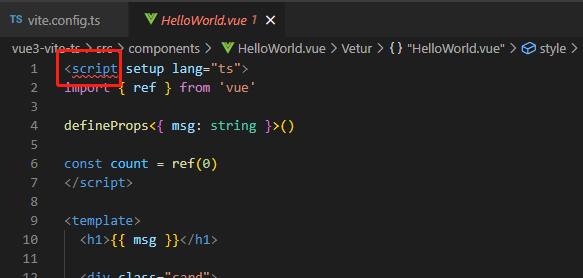

# 项目格式化工具配置

必要的工具是提高开发效率，降低bug率，避免不必要低级错误的重要帮手之一。常见的`Formatter/Linter`工具一般包括`ESLint`、`Prettier`、`StyleLint`等，这里我们使用的编辑器是`VSCode`。

我们以一个`Vue3`、`Ts`、`Vite`的项目为例，并配以`ESLint`、`Prettier`、`StyleLint`、`Husky`、`Lint-Staged`、`Commitlint`相关插件，来规范代码质量，保证代码在风格上的一致性，git提交记录的一致性。


我们先在`VSCode`中安装相关插件：
- `ESLint`
- `Prettier-Code formatter`
- `StyleLint`
另外为了支持`Vue`语法高亮、语法提示等，我们需要安装Vue3的插件，这里安装`Volar`。

然后将插件配置在json文件中`.vscode/extensions.json`，后续别的开发人员打开这个项目时，`VSCode`就会推荐安装这些插件；

```json
{
    "recommendations": [
        "stylelint.vscode-stylelint",
        "esbenp.prettier-vscode",
        "dbaeumer.vscode-eslint",
        "Vue.volar"
    ]
}
```

## 配置ESLint

使用pnpm安装eslint
```js
pnpm create @eslint/config
```
接下来会让选择你想使用ESLint去做什么事？，这里我们选择第二个，检查语法并发现问题。
```js
? How would you like to use ESLint? ...
  To check syntax only
> To check syntax and find problems
  To check syntax, find problems, and enforce code style
```
接着又询问你的项目使用那种模块模式，这里我们选择第一个
```js
? What type of modules does your project use? ...
> JavaScript modules (import/export)
  CommonJS (require/exports)
  None of these
```
接下来是项目框架的选择，我们选择`Vue.js`。
下面的选择就不再一一示例，最终的选项如下：
```js
√ How would you like to use ESLint? · problems
√ What type of modules does your project use? · esm
√ Which framework does your project use? · vue
√ Does your project use TypeScript? · No / Yes
√ Where does your code run? · browser, node
√ What format do you want your config file to be in? · JavaScript
```
当我们安装的时候，发现了一个报错
```js
Installing eslint-plugin-vue@latest, @typescript-eslint/eslint-plugin@latest, @typescript-eslint/parser@latest, eslint@latest
 ERR_PNPM_ADDING_TO_ROOT  Running this command will add the dependency to the workspace root, which might not be what you want - if you really meant it, make it explicit by running this command again with the -w flag (or --workspace-root). If you don't want to see this warning anymore, you may set the ignore-workspace-root-check setting to true.
```
这是因为使用`pnpm`安装时，需要带参数`-w`。
重新安装一下
```sh
pnpm create @eslint/config -w
```
安装成功！生成的`.eslintrc.js`文件
```js
module.exports = {
    "env": {
        "browser": true,
        "es2021": true,
        "node": true
    },
    "extends": [
        "eslint:recommended",
        "plugin:vue/vue3-essential",
        "plugin:@typescript-eslint/recommended"
    ],
    "overrides": [
    ],
    "parser": "@typescript-eslint/parser",
    "parserOptions": {
        "ecmaVersion": "latest",
        "sourceType": "module"
    },
    "plugins": [
        "vue",
        "@typescript-eslint"
    ],
    "rules": {
    }
}
```

打开.vue文件发现，eslint报错，这是因为修改一下`parser: 'vue-eslint-parser'`



### 补全一下安装的插件

```sh
# ESLint核心库
npm install eslint -D

# ESLint结合Vue代码规范
npm install eslint-plugin-vue -D
# ESLint结合Airbnb代码规范(依赖plugin-import)
npm install eslint-config-airbnb-base eslint-plugin-import -D

# 由于ESLint默认使用Espree语法解析，是不能识别TypeScript某些语法，所以需安装@typescript-eslint/parser替换掉默认解析器
npm install @typescript-eslint/parser -D
# 补充额外得typescript语法的规则
npm install @typescript-eslint/eslint-plugin -D

# 在import时可以使用@
npm install eslint-import-resolver-alias -D
# 解决ts别名报错问题
npm install eslint-import-resolver-typescript -D
```
### eslint忽略文件
有一些文件，我们不需要进行`eslint`校验，例如打包好的`dist`文件夹、`node_modules`文件等等。

新建`.eslintignore`文件，并增加如下配置
```sh
node_modules/*
index.html
dist/*
/public/*
/bin/*
.husky/*
.idea/*
.vscode/*
*.md
*.woff
*.ttf
*.d.ts
*.sh
*.log
```
关于`ESLint`的配置基本就到此为止，目前项目中的代码很多都在报红，例如空格的缩进、单双引号、是否需要`;`分割符等，这些配置我们在后面和`Prettier`一起处理。


```sh
npm install vite-plugin-eslint -D
```
在`vite.config.ts`文件中增加下面配置
```ts
import eslint from 'vite-plugin-eslint'
// https://vitejs.dev/config/
export default defineConfig({
  plugins: [vue(), eslint()],
})
```