# 图解vue3.0编译器核心原理

## 概览
Vue.js作为目前最流行的前端框架之一，一些概念和原理还是需要我们前端开发人员了解与深入理解的。

Vue.js涉及的知识点很多，一些重要概念，例如：如何使用`proxy`实现响应式`effect`，虚拟`DOM`的`Diff`算法及演变过程，渲染器原理的实现，编译器、解析器的工作原理，动态节点、静态提升等等；

现在重点采用图解步骤分析一下编译器的简单工作原理；
## 编译器概念

编译器其实就是一段`JavaScript`代码程序，它将一种语言（`A`）编译成另外一种语言(`B`)，其中前者`A`通常被叫做源代码，后者`B`通常被叫做为目标代码。例如我们vue的前端项目的`.vue`文件一般即为源代码，而编译后`dist`文件里的`.js`文件即为目标代码；这个过程就被称为编译（`compile`）

### 关键概念
主要涉及的概念：
- `DSL` 领域特定语言
- `AST` 抽象语法树（Abstract Syntax Tree）
- 有限状态机
- 深度优先算法
## 简单流程
一个标准的编译器流程如下图所示：
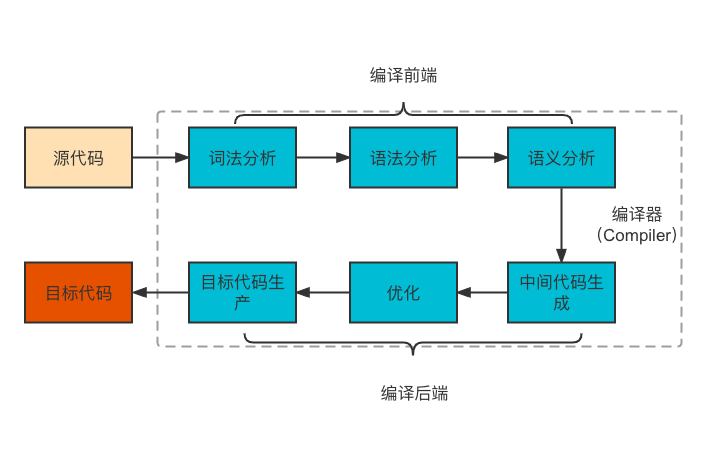
`Vue.js`作为`DSL`，其编译流程会与上图有所不同，对于`Vue.js`来说，源代码就是组件的模板代码，而目标代码就是能够在浏览器（或其他平台）平台上运行的`JavaScript`代码。


## Vue的编译器

`Vue.js`的目标代码其实就是渲染函数（`render`函数）。概况而言，`Vue.js`编译器首先对模板进行词法分析、语法分析，然后得到模板的抽象语法树（`AST`）。随后将模板`AST`转换成`JavaScript` AST，最后再转换成`JavaScript`代码，及渲染函数。一个简单的Vue.js模板编译器的工作流如下：
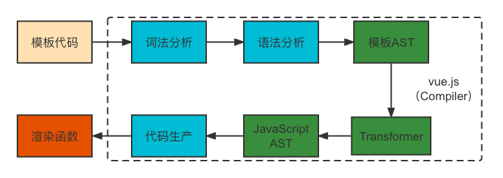

简单如下：
模板代码
```html
<div>
    <h1 id="vue">vue_compiler</h1>
</div>
```
目标的AST
```js
const ast = {
    type: 'Root',
    children: [
        {
            type: 'Element',
            tag: 'div',
            children: [
                {
                    type:'Element',
                    tag: 'h1',
                    props: [
                        {
                            type: 'Attribute',
                            name: 'id',
                            content: 'vue'
                        }
                    ],
                    children: [
                        {
                            type: 'Text',
                            content: 'vue_compiler'
                        }
                    ]
                }
            ]
        }
    ]
}
```
目标代码
```js
function render() {
    return h('div', [
        h('h1', {id: 'vue'}, 'vue_compiler')
    ])
}
```
由以上代码可以看出，`AST`其实就是一个具有层级结构的对象，模板的`AST`与模板具有相同的嵌套结构。每一颗`AST`都有一个逻辑上的根节点，其类型为`Root`，而模板中真正的根节点则作为`Root`节点的`children`存在。

观察`AST`可知：
- 不同类型的节点是通过节点的`type`属性进行区分的。
- 标签节点的子节点存储在其`children`数组中。
- 标签节点的属性节点会存储在`props`数组中。
- 不同类型的节点会使用不同的对象属性进行描述。

## 编译过程
### parse函数

`Vue.js`通过封装`parse`函数，实现对模板的词法分析和语法分析，最终得到模板的AST。`parse`函数接收模板字符串作为参数，并将解析后的`AST`作为返回值返回；
```js
const template = `
    <div>
        <h1>vue<h1>
    </div>
`
const templateAst = parse(template)
```
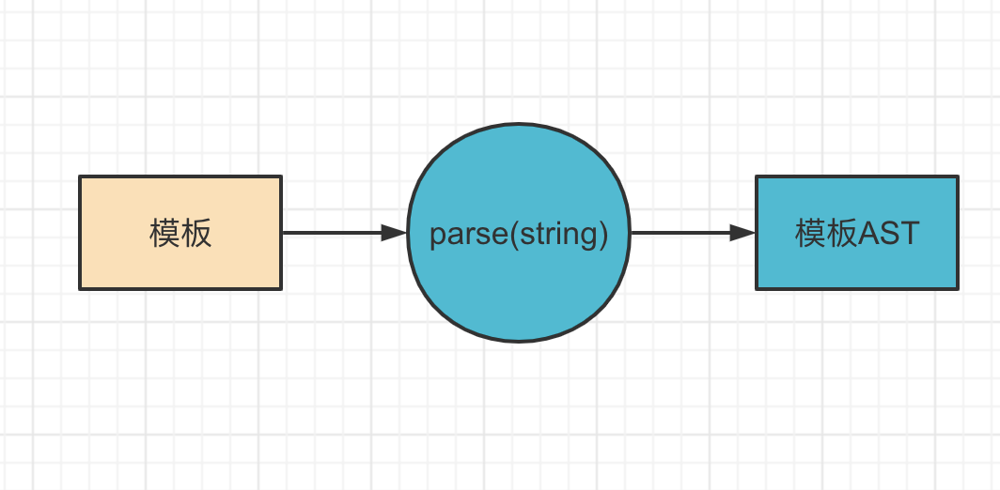

解析器是如何对模板字符串进行分割的呢，此处就需要用到有限状态自动机。指的是在有限个状态之间，随着字符的输入，解析器会自动地在不同的状态之间进行切换。（实际上有限状态机是可以使用正则表达式来实现的）。

简单的状态机流程图：

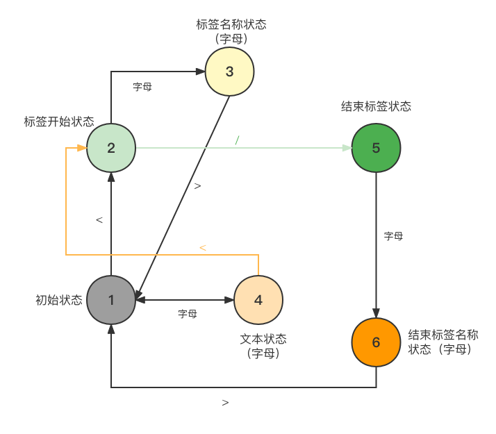

通过有限状态机原理，可一帮助我们完成对模板的标记，最终将得到一系列`Token`（词法标记号）。

假设有如下代码：
```js
const template = `<div><span>Vue</span><p>Vue Compiler</p></div>` // 模板字符串

// 通过有限状态机原理实现词法分解得到三个Token
// 开始标签 <div>
// 文本节点 vue
// 结束标签 </div>

// 最终值为
const tokens = tokenize(template);
// [
//     {
//         type: 'tag', name: 'div'
//     },
//     {
//         type: 'tag', name: 'span'
//     },
//     {
//         type: 'text', name: 'Vue'
//     },
//     {
//         type: 'tagEnd', name: 'span'
//     },
//     {
//         type: 'tag', name: 'p'
//     },
//     {
//         type: 'text', name: 'Vue Compiler'
//     },
//     {
//         type: 'tagEnd', name: 'p'
//     },
//     {
//         type: 'tagEnd', name: 'div'
//     }
// ]


// 此代码需要生成的AST应为
const ast = {
    type: 'Root',
    children: [
        {
            // 实际的根节点
            type: 'Element',
            tag:: 'div',
            children: [
                {
                    type: 'Element',
                    tag:: 'span',
                    children: [
                        {
                            type: 'Text',
                            content: 'Vue'
                        }
                    ]
                },
                {
                    type: 'Element',
                    tag:: 'p',
                    children: [
                        {
                            type: 'Text',
                            content: 'Vue Compiler'
                        }
                    ]
                }
            ]
        }
    ]
}
```
以上代码生成的AST数据结构HTML结构相同，都是树状结构

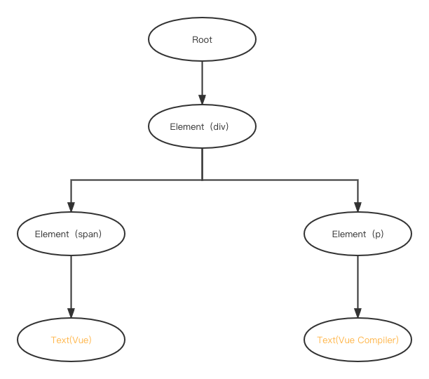

接下来要做的就是将生成的`tokens`转换成`AST`，在转换过程中需要维护一个`Stack`,这个栈将用来维护元素间的父子关系。每到遇到一个开始标签，就创建一个`Element`类型的AST节点，并将其压入栈内，类似的，每当遇到一个结束标签节点，我们就将当前栈顶的节点弹出。这样栈顶的节点将始终充当父节点的角色。转换过程中的所有节点，都将作为当前栈顶节点的子节点，并添加到栈顶节点的`children`属性下。流程如下图示：

最初节点只有根节点Root

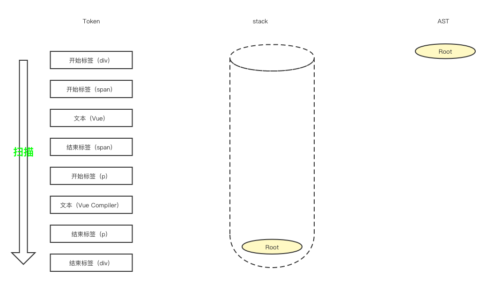

当扫描到第一个标签是开始节点是，因此我们创建一个类型为`Element`的AST节点`Element（div）`，并将该节点作为当前节点的子节点。由于当前的栈顶节点是`Root`节点，所以新创建的`Element（div）`节点作为`Root`节点的子节点被添加到`AST`中，最后将新建的`Element（div）`节点压入栈中。

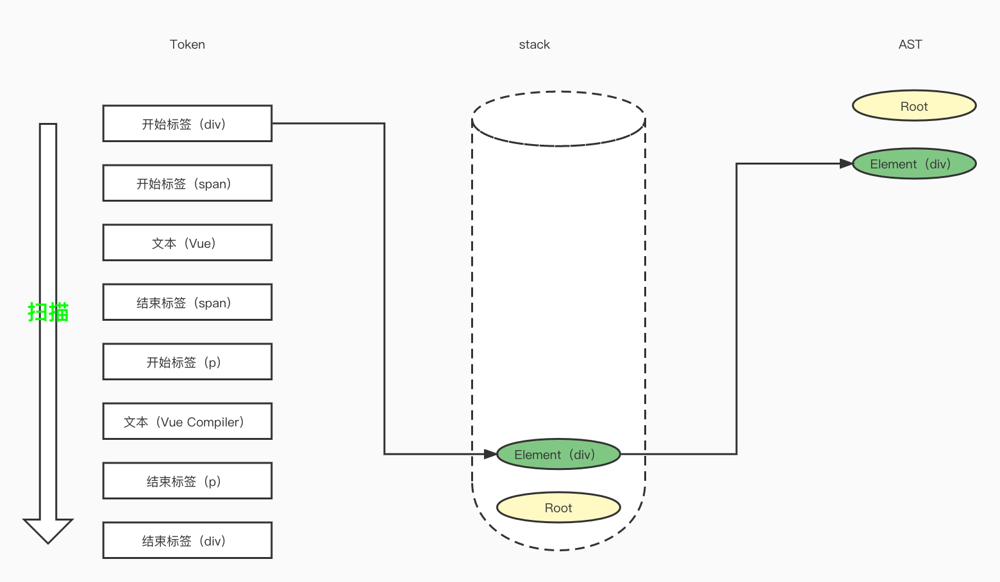

由于第二个节点也是一个开始标签，所以流程同上一步，只不过当前的栈顶节点为`Element（div）`，所以将当前的节点`Element（span）`作为其子节点添加到`AST`中，最后将`Element（div）`节点压入栈中。

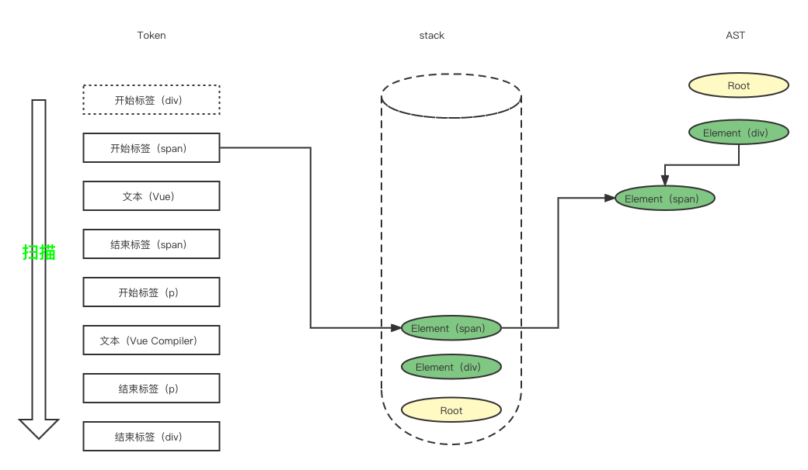

接下来的节点是一个文本节点，所以需要创建一个`Text`类型的`AST`节点，并将其作为栈顶节点`Element（span）`的子节点加入到AST中，不同的时，当前接待不是`Element`类型，所以不需要压入栈中；

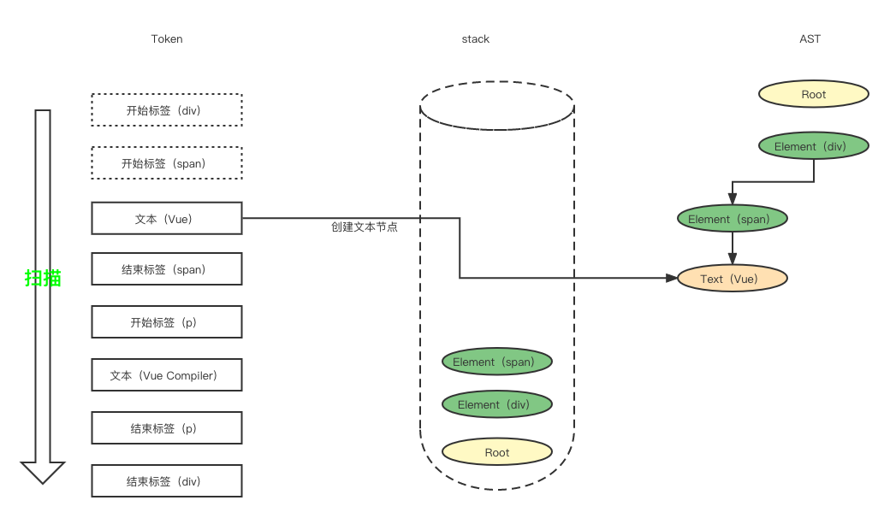

下面是一个结束标签节点，根据规则，则需要将当前栈顶的节点弹出。


后面的流程此处就不在累述

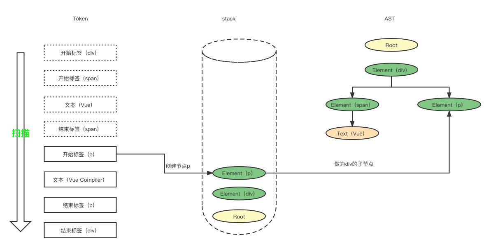

最终完成后的效果如下：

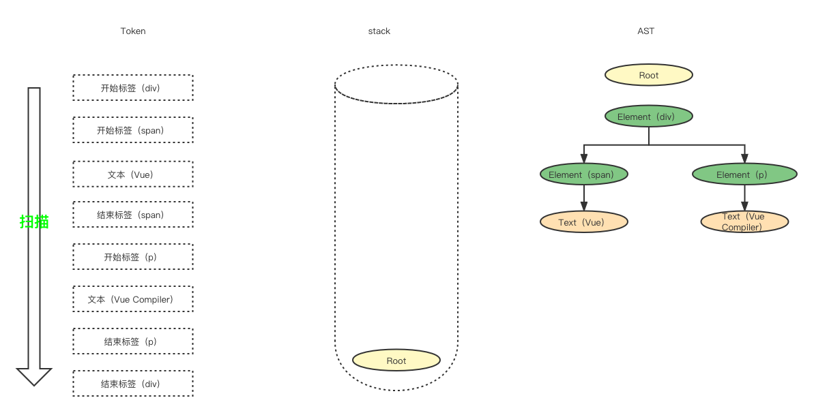

现在我们来实现parse函数
```js
function parse(str) {
    // 对模板进行词法分析，得到节点list
    const tokens = okenize(template);
    // 创建跟节点
    const root = {
        type: 'Root',
        children: []
    };
    // 创建节点栈,root节点作为栈的根节点
    const stack = [root];
    while(tokens.length) {
        const parent = stack[stack.length - 1];
        const token = tokens[0] // 从第一个点开始
        switch(t.type) {
            case 'tag':
                const eleNode = {
                    type: 'Element',
                    tag: t.name,
                    children: []
                }
                parent.children.push(eleNode);
                stack.push(eleNode);
                break;
            case 'text':
                const textNode = {
                    type: 'Text',
                    content: t.content
                }
                parent.children.push(textNode);
                break;
            case 'tagEnd':
                // 结束标签，将栈顶节点弹出栈
                stack.pop();
                break;
        }
        // 消费掉已处理的节点
        tokens.shift()
    }
    return root
}
```
以上就是一个简版的parse函数的实现，当然相对于Vue.js的源码还有很多差异，但基本原理大致相同。

下面关于`transform`函数和`generate`函数仅做了简要说明，具体实现原理敬请期待；
### transform函数
```js
const template = `
    <div>
        <h1>vue<h1>
    </div>
`
const templateAst = parse(template)
const jsAst = transform(templateAst)
```
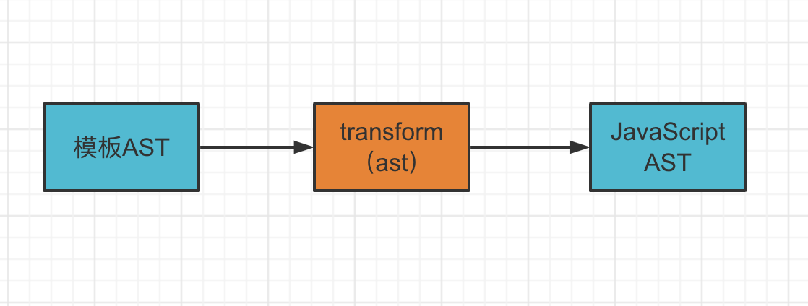
### generate函数

```js
const template = `
    <div>
        <h1>vue<h1>
    </div>
`
const templateAst = parse(template)
const jsAst = transform(templateAst)
const code = generate(jsAst)
```
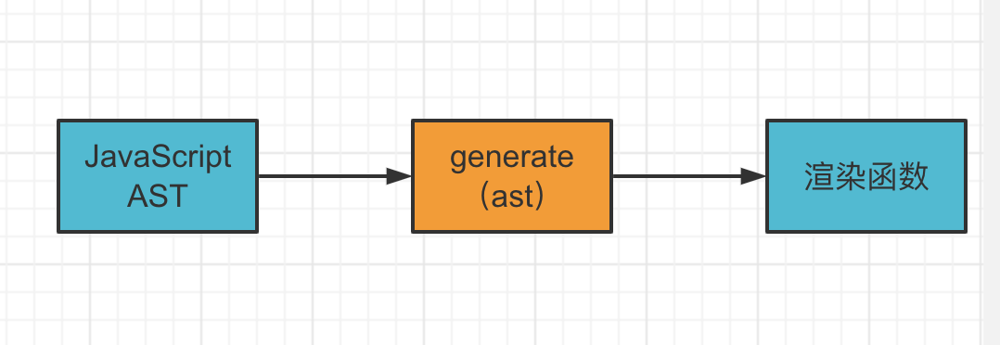

### 完整流程
以上就是`Vue`模板编译器的基本结构和工作流程，它主要有三个部分组成：
- 用来将模板字符串解析为模板`AST`的解析器（`parser`）;
- 用来将模板`AST`解析成`JavaScript AST`的转换器（`transformer`）；
- 用来根据`JavaScript AST`生成渲染函数代码的生成器（`generator`）；

本文章主要讨论了`parser`的基本实现原理（实际上`Vue.js`的真正实现要复杂的多，比如正则解析、`Vue`语法解析`v-if`、`v-show`、内插值`{{}}`等等），以及如何使用有限状态自动机来构造一个词法分析器，其过程就是状态机在不同的状态之间进行迁移的过程，并生成一个`Token`列表集合。然后使用`Token`列表集合和顶节点元素栈来构造一个可以用来描述模板的`AST`，最后使用模板`AST`来解析成`JavaScript AST`和渲染函数。

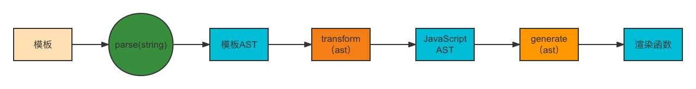

## 参考

Vue.js源码；

Vue.js设计与实现；
