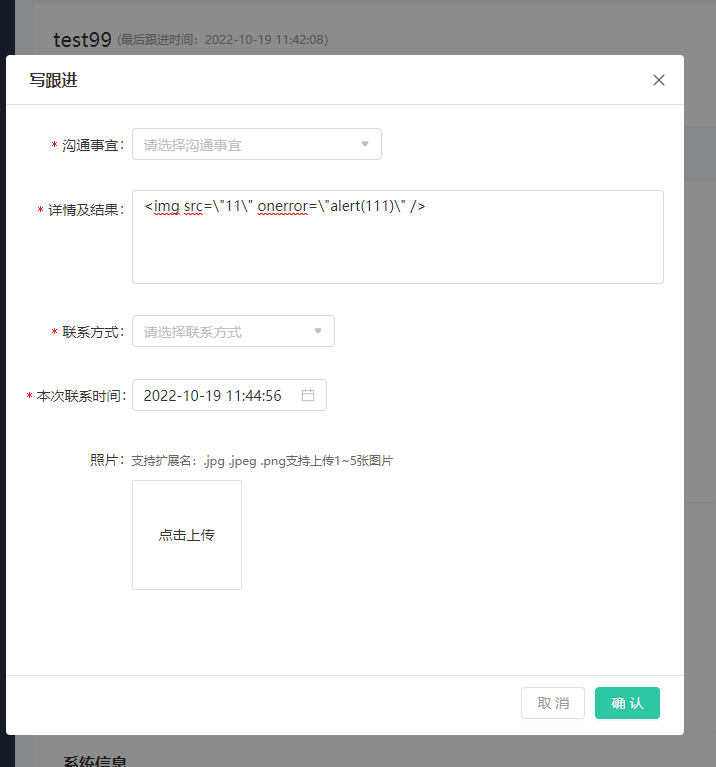
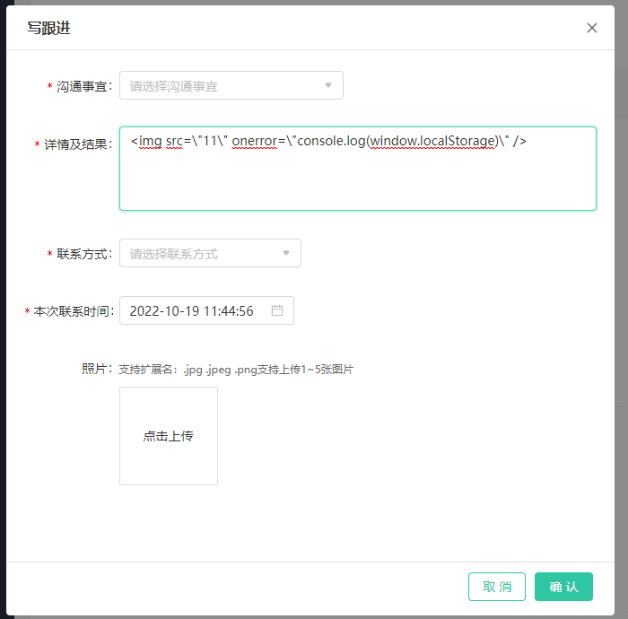
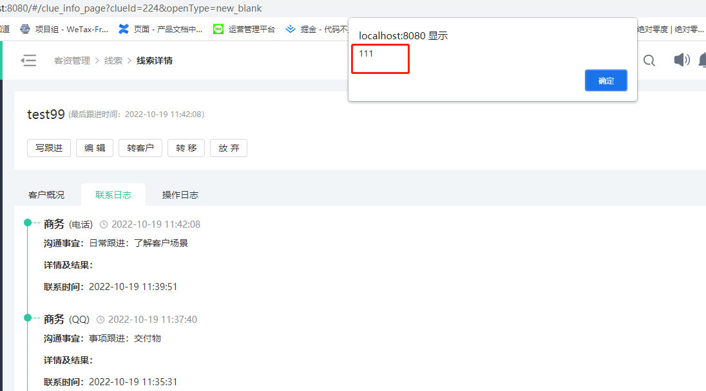
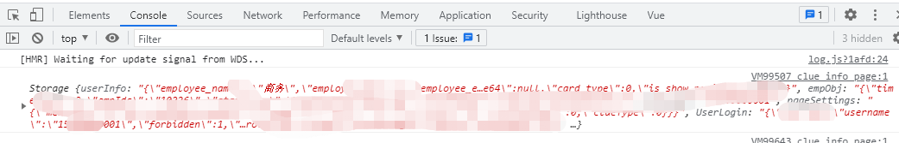

# Web前端安全系列之：XSS攻防

## 前言 Web 安全的兴起

Web 攻击技术的发展也可以分为几个阶段。在 `Web 1.0` 时代，人们更多的是关注服务器端
动态脚本的安全问题，比如将一个可执行脚本（俗称 `webshell`）上传到服务器上，从而获得权
限。后续有出现了`SQL`注入，`SQL`注入的出现是`Web`安全史上的一个里程碑，`SQL`注入漏洞至今仍然是`Web`安全领域中的一个重要组成部分。再后续另一个里程碑的安全问题问世--`XSS`（跨站脚本攻击）。伴随着 `Web 2.0` 的兴起，`XSS`、`CSRF` 等攻击已经变得更为强大。`Web` 攻击的思路也从服务器端转向了客户端，转向了浏览器和用户。

`Web` 技术发展到今天，构建出了丰富多彩的互联网。互联网业务的蓬勃发展，也催生出了
许多新兴的脚本语言，比如 `Python`、`Ruby`、`NodeJS` 等，敏捷开发成为互联网的主旋律。而手机技术、移动互联网的兴起，也给 `HTML 5` 带来了新的机遇和挑战。与此同时，`Web` 安全技术，也将紧跟着互联网发展的脚步，不断地演化出新的变化。

跨站脚本攻击（`XSS`）是客户端脚本安全中的头号大敌。`OWASP TOP 10` 威胁多次把 `XSS`
列在榜首，该篇文章将重点介绍`XSS`的攻防问题

## 初探`XSS`

**跨站脚本攻击**，英文全称是 `Cross Site Script`，本来缩写是 `CSS`，但是为了和层叠样式表（`Cascading Style Sheet`，`CSS`）有所区别，所以在安全领域叫做“`XSS`”。

`XSS`攻击，通常指黑客通过`HTML`注入 篡改网页，插入恶意脚本，从而在用户浏览网页时，控制用户浏览器的一种攻击行为。在这种行为最初出现之时，所有的演示案例全是跨域行为，所以叫做 "跨站脚本" 。时至今日，随着`Web`端功能的复杂化，应用化，是否跨站已经不重要了，但 `XSS`这个名字却一直保留下来。

随着`Web`发展迅速发展，`Web`开发已经被应用的非常广泛了，由之前的单一`PC`端扩展到现在的移动端（`APP`、`H5`），甚至包括桌面工具、设备大屏等等，所以在产生的应用场景越来越多，越来越复杂的情况下，同时大多数互联网（尤其是传统行业）的产品开发版本迭代上线时间非常短，一周一版本，两周一大版本的情况下，忽略了安全这一重要属性，一旦遭到攻击，后果将不堪设想。

## `XSS`攻击类型分类
`XSS`攻击可以分为3类：反射型（非持久型）、存储型（持久型）、基于`DOM XSS`；
### 反射型
反射型`XSS`只是简单地把用户输入的数据“反射”给浏览器。也就是说，黑客往往需要诱使用户“点击”一个恶意链接，才能攻击成功。反射型`XSS`也叫做 **“非持久型 `XSS`”（`Non-persistent XSS`）**。

通常反射型`XSS`的恶意代码存在`URL`里，通过`URL`传递参数的功能，如网站搜索、跳转等。由于需要用户主动打开恶意的`URL`才能生效，攻击者往往会结合多种手段诱导用户点击。

一个最初级的反射型攻击是：我们对网页数据进行获取:
```html
<!DOCTYPE html>
<html lang="en">
<head>
    <meta charset="UTF-8">
    <meta http-equiv="X-UA-Compatible" content="IE=edge">
    <meta name="viewport" content="width=device-width, initial-scale=1.0">
    <title>XSS攻防演练</title>
</head>
<body>
    <div id="t"></div>
    <input id="s" type="button" value="这是一个按钮" onclick="test()">
</body>
<script>
    function test() {
        const arr = ['自定义的数据1', '自定义的数据2', '自定义的数据3', '']
        const t = document.querySelector('#t')
            arr.forEach(item => {
            const p = document.createElement('p')
            p.innerHTML = item
            t.append(p)
        })
    }
</script>
</html>
```
当黑客点击`这是一个按钮`时，即可轻松获取本地`localStorage`数据，从而获取关键信息。
### 存储型
存储型 `XSS` 会把用户输入的数据“存储”在服务器端。这种 `XSS` 具有很强的稳定性。

比较常见的一个场景就是，黑客写下一篇包含有恶意 `JavaScript` 代码的博客文章，文章发表后，所有访问该博客文章的用户，都会在他们的浏览器中执行这段恶意的 `JavaScript` 代码。黑客把恶意的脚本保存到服务器端，所以这种 `XSS` 攻击就叫做 **“存储型 `XSS`”**。
```html
<!-- 例如我们分别在网站中的输入框中输入以下信息，并保存到远程数据库 -->


```
页面输入




使用者浏览页面，分别先后触发了`alert`弹框和`localStorage`获取本地数据：




以上就是一个典型的**存储型**攻击。
### 基于`DOM XSS`
实际上，这种类型的`XSS`并非按照“数据是否保存在服务器端”来划分，`DOM Based XSS`从效果上来说也是反射型`XSS`。单独划分出来，是因为`DOM Based XSS` 的形成原因比较特别，发现它的安全专家专门提出了这种类型的 `XSS`。出于历史原因，也就把它单独作为一个分类了。
## `XSS`攻击防御

### `HttpOnly`

### 输入检查

### 输出检查

### 防御 DOM Based XSS

## `Vue`中的`XSS`防御

如果你在项目中使用了`Vue`作为前端开发框架，恭喜你，`Vue`将为你解决绝大多数的`XSS`攻击问题，但是`Vue`不是一个预防`XSS`攻击的框架，在开发使用的时候还是有被攻击的漏洞存在；

### `Vue`中的防御措施
不论使用模板还是渲染函数，`Vue`都会将插值的内容都会自动转义。也就是说对于这份模板：

```html
<template>
    <p>{{userData}}</p>
</template>

<script>
    // 从远程获取的数据
    userData = "<script>alert('xss')</script>"
</script>
```

最终编译后页面显示的`html`源码内容如下：

```html
<p>
    <script>alert('xss')</script>
</p>
```
原因是`Vue`帮我们对数据进行了转义，因此避免了脚本注入。该转义通过诸如 textContent 的浏览器原生的 API 完成，所以除非浏览器本身存在安全漏洞，否则不会存在安全漏洞。转义后的内容如下：
```html
&lt;script&gt;alert(&quot;xss&quot;)&lt;/script&gt;
```
### 注入`HTML`

如果你要动态注入远程的`HTML`内容，首先你应该确保这些内容是安全有效的，否则你应该采取一些防御措施，去过滤或转义掉一些危险的标签符号；例如你可以这样显示的渲染`HTML`：
```html
<!-- 当使用模版时 -->
<div v-html="userProvidedHtml"></div>

<!-- 当使用渲染函数时 -->
<script>
    h('div', {
    domProps: {
        innerHTML: this.userProvidedHtml
    }
    })
</script>
<!-- 当使用JSX 的渲染函数时 -->
<div domPropsInnerHTML={this.userProvidedHtml}></div>
```
例如我们可以使用一个简单的方法（或者引用一个更加健壮的库/插件[XSS](https://jsxss.com/zh/index.html)来过滤一遍这个远程的`userProvidedHtml`数据内容，以确保安全；
```js
// 一个简单的函数，通过转义<为&lt以及>为&gt来实现防御HTML节点内容
const escape = function(str){
    return str.replace(/</g, '&lt;').replace(/>/g, '&gt;')
}
```
### 样式注入

在使用`Vue` 要在模板内避免渲染 `style` 标签:
```html
<style>{{ userProvidedStyles }}</style>
```
这是因为，一但通过`userProvidedStyles`，恶意用户仍可以提供 `CSS` 来进行“点击诈骗”，例如将链接的样式设置为一个透明的方框覆盖在“登录”按钮之上。然后再把` https://user-XSS-website.com/` 做成你的应用的登录页的样子，它们就可能获取一个用户真实的登录信息，所以Vue推荐使用`对象语法`且只允许用户提供特定的可以安全控制的`property`的值:

```html
<!-- sanitizedUrl应为受控的地址 -->
<a
  v-bind:href="sanitizedUrl"
  v-bind:style="{
    color: userProvidedColor,
    background: userProvidedBackground
  }"
>
  click me
</a>
```


## 安全问题“没有银弹”
>在解决安全问题的过程中，不可能一劳永逸，也就是说“没有银弹”。

>一般来说，人们都会讨厌麻烦的事情，在潜意识里希望能够让麻烦越远越好。而安全，正是一件麻烦的事情，而且是无法逃避的麻烦。任何人想要一劳永逸地解决安全问题，都属于一相情愿，是“自己骗自己”，是不现实的。

## 最佳实践

通用的规则是只要允许执行未过滤的用户提供的内容 (不论作为 `HTML`、`JavaScript` 甚至 `CSS`)，你就可能令自己处于被攻击的境地。这些建议实际上不论使用 `Vue`、`React`还是别的框架甚至不使用框架，都是成立的。