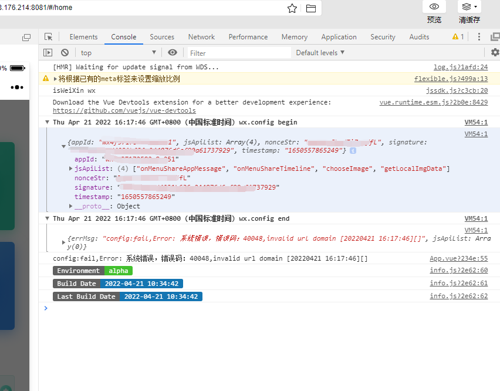
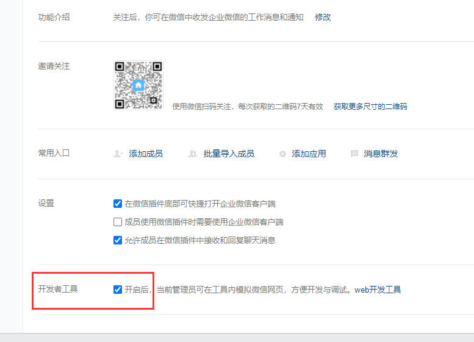
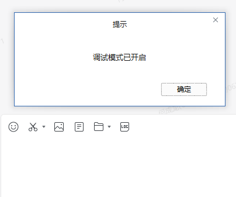
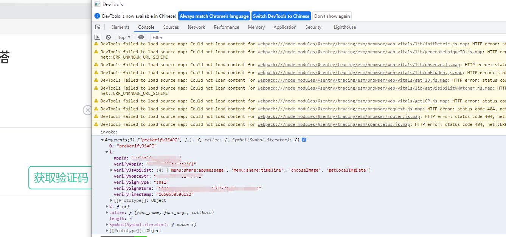
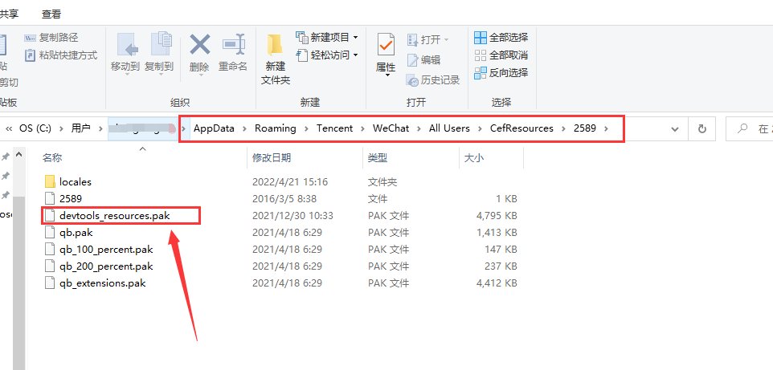
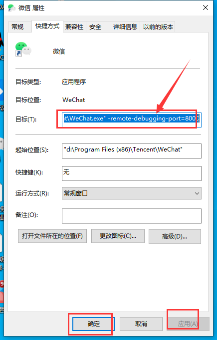
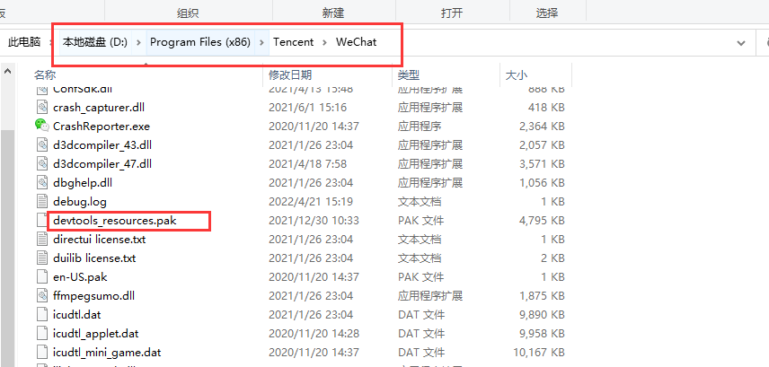

# 困境

项目开发的h5页面需要在微信端支持转发、分享功能，以及企业微信授权等相关权限功能，h5页面功能开发可以直接在`Chrome`浏览器的移动端模式开发，但是涉及微信权限时的一些功能，则需要在微信和企业微信中进行调试；

## 微信开发者工具

一些功能可以使用微信开发者工具，比如`jsdk`微信授权等
如图所示：

## 企业微信PC端调试

企业微信调试时，需要在管理端打开dev调试功能开关

然后打开企业微信，使用快捷键`Ctrl+Alt+Shift+D`,即可打开dev模式

然后打开企业微信中的相关h5页面，右键点击即可打开Chrome控制台

## 微信PC端调试

痛点来了，微信Pc端的`dev`功能要麻烦一点，我本地一直用的好好的，后来不知道什么时候不能使用，然后发现是升级了本地的微信版本，新版本已经不支持`打开Chrome控制台`模式。（希望以后还可以继续打开`dev`模式）

### 版本回退

下载旧版本微信客服端，貌似3.2.1版本之前的都可以，这里是[下载地址](https://download.csdn.net/download/cheng521521/85194684)

### 下载 devtools_resources.pak
`devtools_resources.pak`是必须的，这是[下载地址](https://download.csdn.net/download/cheng521521/85194701)
### 查看微信浏览器版本
找到记录 --resources-dir-path 的路径

一般在`C:\Users\**\AppData\Roaming\Tencent\WeChat\All Users\CefResources\2581`,然后把`devtools_resources.pak`放入文件夹中

### 配置微信快捷方式

在微信快捷方式，右键点击属性，目前后面增加 `-remote-debugging-port=8000`

### 配置微信安装目录
再把`devtools_resources.pak`放入微信的安装文件夹中，安装目录一般在D盘中

现在大功告成，重启微信，打开h5页面，右键即可打开开发者工具

