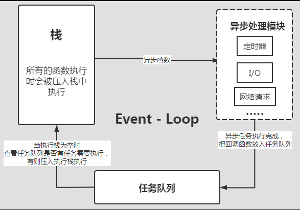

# JavaScript的事件循环
`JavaScript`语言的一大特点就是单线程，也就是说，同一个时间只能做一件事。那么，为什么`JavaScript`不能有多个线程呢？这样能提高效率啊。这也与它的用途有关。作为浏览器脚本语言，`JavaScript`的主要用途是与用户互动，以及操作DOM。这决定了它只能是单线程，否则会带来很复杂的同步问题

`JavaScript`是一门单线程执行语言。这句话直接定义了`JavaScript`程序执行顺序的核心，单线程意味着代码需要一行一行按照顺序执行，如果遇到一个大的循环语句或者远程加载图片资源等等语句，整个程序都会出现假死现象，直到当前的任务执行完毕，才会继续执行下面的程序。为了解决上面的问题，于是出现了同步执行、异步执行（宏任务与微任务）。

同步任务非常常见：比如上面描述的`JavaScript`按序执行、页面渲染、远程加载`JavaScript`资源等等都是同步任务。

## JavaScript的执行机制

在介绍`JavaScript`的异步任务前，我们先来了解一下`JavaScript`的执行机制。

主线程从"任务队列"中读取事件，这个过程是循环不断的，所以整个的这种运行机制又称为`Event Loop（事件循环）`。为了更好的理解这句话，请看下图及代码解释。



```js
console.log(1) // 用a代表
setTimeout(() => { // 用b代表
  console.log(2) // 用c代表
}); 
console.log(3); // 用d代表
```
上述代码执行过程如下：
- 因为JavaScript是单线程，执行栈按顺序执行上面代码，首先遇到同步代码`a`并将a压进执行栈，执行输出结果，并弹出该函数语句；
- 任务队列继续执行，遇到b异步函数`setTimeout`，因为是异步函数所以立马从栈中弹出，并异步执行模块（Event Queue）事件队列中，等待执行。
- 遇到同步函数`d`，执行方式同上面的a。
- 现在执行栈中为空，没有同步函数需要被执行，则取任务队列中查看，如果有任务就会压入执行栈执行。此时任务队列中有函数`c`，则被压入栈中执行。
- 如果后续的`c`中继续存在异步任务，则会继续被放入到任务队列中等待被执行。

整个循环的过程就是`Event Loop（事件循环）`。


## 宏任务与微任务

任务队列（`Event Queue`）有的也叫（消息队列），里面的任务可分为宏任务（`Macro-task`）和微任务( `Micro-task` ) 。

宏任务（`Macro-task`）:
- `setTimeout`
- `setInterval`
- `I/O`
- `UI render`
- `requestAnimationFrame`

微任务(`Micro-task`) :
- `Promise.then()`
- `Async/Await`
- `MutationObserver`


## setTimeout和setInterval

首先我们先来看`setTimeout`，这个api我们一般是在执行异步任务时使用，比如想在3秒后执行一个`console`；
```js
setTimeout(() => {
  console.log('我被执行了哈！！！');
}, 3000);

```
大多数情况下，这句代码执行的效果和我们期望的基本一直，即3秒后控制台输出 `我被执行了哈！！！`。

但是基本之外就是一符合的预期，有时候我们期望`500ms`执行一个操作，但是确在`2s`之后执行了;
```js
setTimeout(() => {
  console.log('我执行了一个操作！！！');
}, 500);

for (let index = 0; index < 10000000; index++) {
  // 这里遇到一个循环语句，大概执行了2秒
}
```
这里我们解释一下上面的代码执行顺序及原理：
- 首先遇到一个异步操作，需要将`console.log('我执行了一个操作！！！');`放入异步队列模块中注册，然后开始定时器开始计时。
- 接着执行同步操作for循环语句，但是该语句执行的时间稍微有那么一点长，足足执行了2秒。
- 前面的定时器计时500毫秒已经到了，`console.log('我执行了一个操作！！！');`进入Event Queue中等待被放入执行栈中执行，但是不幸的是，前面的for循环执行还没结束，现在只能等待，直到for循环执行完毕才被执行；
- 执行完毕，这时的时间已经比预期的500毫秒超出好多。

其实`setInterval`和`setTimeout`的执行类似，这里就不在累述。唯一需要注意的一点是，对于`setInterval(fn,ms)`来说，我们已经知道不是每过ms秒会执行一次fn，而是每过ms秒，会有fn进入`Event Queue`

所以作为异步的setTimeout和setInterval的问题是，它们都不精确。它们的内在运行机制决定了实际的时间间隔，参数实际上只是指定了把要执行的代码添加到`JavaScript（浏览器UI）`线程队列中以等待执行的时间。如果队列前面已经加入了其他任务，那要执行的代码就要等前面的任务完成后再执行。

## requestAnimationFrame

`requestAnimationFrame`是`window`的方法，告诉浏览器——你希望执行一个动画，并且要求浏览器在下次重绘之前调用指定的回调函数更新动画。

`requestAnimationFrame`的用法其实与`setTimeout`和`setInterval`类似，只是不需要设置时间间隔而已，且精度要优于后两者。

`requestAnimationFrame`的执行通常与浏览器屏幕刷新次数相匹配，保持最佳绘制效率，不会因为间隔时间过短，造成过度绘制，增加开销；也不会因为间隔时间太长，使用动画卡顿不流畅，让各种网页动画效果能够有一个统一的刷新机制，从而节省系统资源，提高系统性能，改善视觉效果。

## Promise

先要说明的是`new Promise()`是同步任务，而`.then`则是异步微任务；

关于Promise与async、await的细节，请参考[你不知道的 async、await 魔鬼细节](https://juejin.cn/post/7194744938276323384#heading-2)这篇文章；