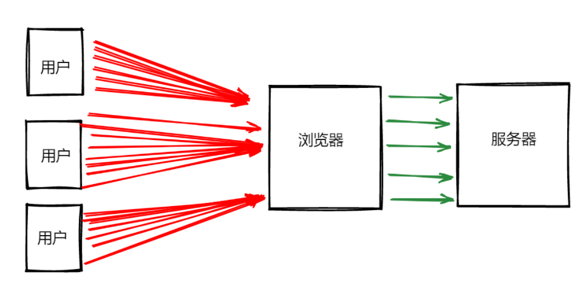

## 把一个 url 拆解成 origin、文件名、hash 拆解成示例的格式

首先需要明白一个 URL 的组成分为几部分，以这个`http://localhost:8080/article/details/109065450/?id=14d76037-6462-445a-8d64-00c6b517db11&openType=new_blank#/client_info/client_info_page`为例

- 协议： 常见的协议有两种，一种是`http://` 一种是`https(http+ssh)://`
- 域名：`localhost`
- 端口： 一般范围在 0-65535 之间，默认端口 http 是 80，https 为 443
- 文件路径：`/article/details/109065450`
- hash：一般以#开头`#/client_info/client_info_page`
- 参数： 一般以?开头以=连接的键值对，多个键值对采用&分割`?id=14d76037-6462-445a-8d64-00c6b517db11&openType=new_blank`

解析一个 URL，这里利用创建一个 a 标签解析

```js
const url =
  "http://localhost:8080/article/details/109065450/?id=14d76037-6462-445a-8d64-00c6b517db11&openType=new_blank#/client_info/client_info_page";
const parse = (path) => {
  let data = {
    path: "",
    query: {},
    origin: "",
    hash: "",
  };
  const tag = window.document.createElement("a");
  tag.href = path;
  data.origin = tag.origin;
  data.hash = tag.hash;
  data.path = tag.pathname;
  let pathList = tag.search.split("?");
  //获取query
  if (pathList[1]) {
    let queryList = pathList[1].split("&");
    queryList.map((item) => {
      let queryData = item.split("=");
      data.query[queryData[0]] = queryData[1];
    });
  }
  return data;
};
console.log(parse(url));
```

最后输出的值

```js
{
  hash: "#/client_info/client_info_page";
  origin: "http://localhost:8080";
  path: "/article/details/109065450/";
  query: {
    id: "14d76037-6462-445a-8d64-00c6b517db11";
    openType: "new_blank";
  }
}
```

## 两个数组合并成一个数组

现在需要将两个数组 arr1 和 arr2 合并成一个新的 newArr

1.es6 的解构

```js
const newArr = [...arr1, ...arr2];
// 该操作会生成一个新的数组，而不改变原来的数组
```

2.使用`concat`方法

```js
const newArr = [];
newArr.concat(arr1, arr2);
```

3.使用`push`或`unshift`方法添加

```js
newArr.push(...arr1);
newArr.push(...arr2);
// 或者
newArr.unshift(...arr1);
newArr.unshift(...arr2);
```

关于算法优化的问题

## 大小驼峰转换

首先需要明白一点小驼峰和大驼峰的概念

- 小驼峰：首单词的首字母小写，其他单词的首字母大写，例如：`className`
- 大驼峰：单词的首字母都大写，例如`ClassName`

### 将下划线转化为小驼峰

```js
function underlineToSmallCamel(str) {
  return str.toLowerCase().replace(/_([a-z])/g, function (s, s1) {
    return s1.toUpperCase();
  });
}
const a = underlineToSmallCamel("class_name_type");
console.log(a);
// classNameType
```

### 将小驼峰转化为下划线

```js
function camelToUnderline(camelStr) {
  return camelStr
    .replace(/[A-Z]/g, function (s) {
      return " " + s.toLowerCase();
    })
    .trim()
    .replaceAll(" ", "_");
}
camelToUnderline("classNameType");
// "class_name_type"
```

### 大小驼峰转换

```js
function camelToUpperCase(str) {
  if (!str) return "";
  return str.replace(/[a-z]/, function (s) {
    return s.toUpperCase();
  });
}
camelToUpperCase("classNameType");
// ClassNameType
```

## 首屏优化的方案

### 代码
- 路由懒加载
- 异步组件
- 按需加载UI库，tree-skaning优化
- 页面使用骨架屏（Skeleton）
### 网络
- 使用CDN加速，将通用库从vendor进行抽离
- 图片懒加载减少占用带宽
- JavaScript代码使用预加载和异步加载（`功能独立且不要求马上执行的js文件可以使用async，优先级低且没有依赖的js，加入defer`）
- 雪碧图
### 缓存
- webpack、vite（打包工具）开启gzip压缩
- Nginx开启Gzip功能
## 前端如何处理高并发问题

如果一次性增加 100 万个用户访问项目，前端角度你会怎么优化

如果一个项目同时被百万以上基本的用户访问，就会涉及到高并发的问题，而前端需要关注的则是如何减少减轻资源请求，以降低对后端服务器的压力。



所以要在前端优化关于高并发的问题，还是优化前端资源的问题，这和前端首屏优化方案有点类似。

- 图片压缩、CSS sprites、小图片base64编码等等。
- 多个文件合并成一个文件，减少http的请求数量
- 静态资源上传cdn
- 设置响应头cache-control和last-modified
- 代码压缩（去空格、去回车、去注释、替换较长变量名称等等）；
- 函数防抖节流应用，减少短时间内高频请求接口，降低api访问次数；

## Property与attribute的区别

在 `JavaScript` 中，`property`和 `attribute`是两个不同的概念，它们的区别如下：

- 属性是 `JavaScript` 对象中的一个键值对，其中键是一个字符串，值可以是任何类型的值，包括其他对象、函数、字符串、数字等。例如，对于一个对象 `obj`，`obj.name` 是一个属性，它的键是 `"name"`，它的值可以是字符串、数字或其他对象等。
- 特性是`HTML`元素的一种附加信息，它是为了描述 `HTML` 元素的状态或特征而添加的。`HTML` 元素的特性可以在标签中使用，也可以在 `JavaScript` 中使用。例如，在 `HTML` 中，`img` 元素有一个 `"src"` 特性，它指定了要显示的图像的 `URL`。在 `JavaScript` 中，可以使用元素的 `"getAttribute" `方法来获取特性的值，例如，`img.getAttribute("src")`。
- `property`和`attribute`之间存在一定的关联，但它们并不总是相等的。在 `HTML` 中，一些特性与属性有相同的名称，例如 `"id"`，`"name"`，`"value"` 等。在这种情况下，它们的值通常是相同的。但是，其他特性和属性之间可能存在差异，例如 `"class"` 特性在 `JavaScript` 中对应的是 `"className"` 属性。
- 在修改 `HTML` 元素的`attribute`时，可能会影响到其对应的`property`，反之亦然。例如，在 `JavaScript` 中使用元素的 `"setAttribute"` 方法可以修改其`attribute`的值，而在 HTML 中修改某些`attribute`的值可能会导致对应的`property`也发生变化。

总之，`property`和`attribute`是两个不同的概念，`property`是 `JavaScript` 对象中的键值对，而`attribute`是 HTML 元素的一种附加信息，它们之间有些关联，但并不总是相等的。


## 分别用es5和es6的方式解决一个继承问题

在 ES5 中，可以使用原型链继承来解决继承问题。代码如下：
```js
function Animal(name) {
  this.name = name;
}

Animal.prototype.speak = function() {
  console.log(this.name + " makes a noise.");
}

function Dog(name) {
  Animal.call(this, name);
}

Dog.prototype = Object.create(Animal.prototype);
Dog.prototype.constructor = Dog;

Dog.prototype.speak = function() {
  console.log(this.name + " barks.");
}

var dog = new Dog("Fido");
dog.speak(); // 输出 "Fido barks."

```
在 ES6 中，可以使用 class 和 extends 关键字来定义子类，并使用 super 来调用父类的构造函数和方法。代码如下：
```js
class Animal {
  constructor(name) {
    this.name = name;
  }
  
  speak() {
    console.log(this.name + " makes a noise.");
  }
}

class Dog extends Animal {
  constructor(name) {
    super(name);
  }
  
  speak() {
    console.log(this.name + " barks.");
  }
}

let dog = new Dog("Fido");
dog.speak(); // 输出 "Fido barks."
```
在这个例子中，Dog 类继承了 Animal 类，并重写了 speak 方法。使用 super 调用了父类的构造函数和方法。
## 用递归的思路实现 1 - 100 求和

## 三十个数字（自然数）每三个 return 出去，最后只剩下一个，求剩下的这个是几？

## url 访问都发生了什么（详细阐述）

## var string = "小明"，写一个函数实现 string.fn() = "她叫小明"

## 事件循环的机制了解吗？宏任务和微任务的执行顺序是怎样的？

## 怎么理解闭包这个定义的，在平时工作中有用到闭包的使用吗，举个例子。

## TCP 协议三次握手、四次挥手的过程，为什么挥手要 4 次,以及报文是怎么加密和传送的？

## 说一下你在项目的安全性做了哪些工作（侧重网络协议方面的安全）？

## 你们现在整个登录鉴权是怎么设计的？如果要考虑单点登录呢，会如何设计？

## 前端页面无感刷新 token 的技术方案？

## 浏览器的重排重绘了解嘛，一般在写页面的时候会有哪些考虑？

## 内存泄漏和内存溢出有什么区别

## 你在做完前端项目之后，一般都会写哪些文档

## 基于你的脚手架做了哪些优化？

## 有在项目中遇到过 xss 攻击吗？
