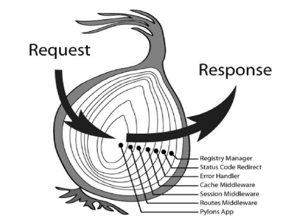

## 使用一个 Node 中间件解决前端跨越问题

用 node 写一个前端跨域的中间件

## 模拟一个 V8 引擎解析器

## 构建工具的优势

在现代使用现代框架时，都会基于一个构建工具协助开发和打包编译，使用构建工具有以下优势：

- 可以方便使用现代框架，例如 Vue、React 等。
- 可以使用 ES 的 export 等特性进行模块化管理，抽离模块、组件并交给构建工具打包处理。
- 优化代码体积，利用打包工具的 tree-skaking 特性移除无用代码，懒加载和 Chunk 分割，对代码进行压缩。
- 对海量的 npm 包支持开箱即用，构建工具负责按需抽离合并。
- 可以使用 CSS 等 Sass、less 等预处理器，提高 Css 的开发效率。
- 对 TypeScript 的友好支持，开发工具进行编译处理。
- 可以使用 ESlint、StyleLint 等代码风格校验、git hooks 工具。

## Node 版本的知识点

node 的版本有 LTS 和 Current 之分，并且拥有不同的版本号。

current 版本是最新发布版本，里面包含这个版本系列的最新功能，但是有些功能需求完善或者修复做兼容处理。

node 每 6 个月就会发布一次 Current 版本，其中新偶数版本每年 4 月份发布，奇数版本每年的 10 月份发布。每个版本会在这个阶段持续活跃 6 个月，期间进行维护和更新。但是满 6 个月以后将有以下区别：

- 其中如果大版本是奇数，将不再进行支持，不会进入到 LTS 版本阶段。
- 如果大版本是偶数，则进行到 LTS 阶段，并且作为活跃的稳定版投入使用。

LTS 版本，全程 Long Time Support 即长期维护版本。每个 LTS 版本大概会进行长达 30 个月的维护时间，其中会经历 Active 阶段（大约是 18 个月）进行积极维护和升级，然后经历 Maintenance 阶段（大约 12 个月）进行错误修复和安全补丁。

## 关于 package.json 中的 Type

`package.json`中的 type 字段是关于模块规范的定义，有两个值可供选择`commonjs`和`module`，其中`commonjs`是默认值。

- 当设置为`commonjs`时，拓展名称为`.js`和`.cj`的文件都是`commonjs`规范的模块，如果要使用`ES Module`规范，则需要使用`.mjs`为拓展名。
- 当设置为`module`时，拓展名称为`.js`和`.mjs`的文件都是`ES Module`规范的模块，如果使用`commonjs`规范，则需要使用`.mjs`作为拓展名.

更多信息，请参考[npm Docs](https://docs.npmjs.com/cli/v8/configuring-npm/package-json)

## require资源加载规则

`require`加载模块资源时的规则一般如下：

```js
const demo1 = require('./utils')
const demo2 = require('/utils')
const demo3 = require('utils')
```
- 如果参数是以`/`开头，则表明需要加载的是一个绝对路径文件；
- 如果参数是以`./`开头，表明需要加载的是一个相对路径文件；
- 如果参数不是以`/`或`./`开头，则表明加载的是一个核心模块或者当前项目中`node_modules`文件夹下的模块；
- 如果没有找到指定的模块文件，`Node.js`则会尝试自动添加`.js`、`.json`、`.node`后缀，再去搜索文件。
- 如果传入`require`的参数是一个目录，则`node.js`会自动读取该目录下面的`package.json`文件，并根据该文件的main字段来加载真正的入口文件。如果该目录下没有`package.json`文件，则会尝试加载该目录下的`index`文件，并根据后缀优先级查找文件。

## Koa与Express的主要差别

首先`Koa`与`Express`是由一个开发团队打造的。
- `Koa`使用了`Promise`、`async/await`语法来进行异步编程，从根本上解决了传统`Node.js`异步编程风格存在的问题。
- `express`是基于事件和回调的，这会产生多层回调嵌套的问题，造成回调地狱，不利于代码维护
- `Koa`核心不绑定任何中间件，因此`Koa`核心更纯净。
## 中间件的一般作用
- 执行逻辑代码；
- 更改请求或响应对象；
- 结束请求-响应周期；
- 调用下一个中间件；
- 错误处理；
- 都需要调用next,来将执行权限交个下一个中间件；
- 如果发起一个请求，任何中间件都没有输出响应，在`Koa`中此次请求将返回404状态码，而在`Express`中请求将被挂起。造成这种差别的原因是`Koa`使用的是`Promise`来进行异步编程的，不需要执行回调函数（直接对body进行赋值即可），而`Express`则需要手动执行回调函数。

## Koa中间件的洋葱模型

`Koa`的洋葱模型是以`next()`函数为分割点，先由外到内执行`Request`的逻辑，然后再由内到外执行`Response`的逻辑，这里的`request`的逻辑，我们可以理解为是`next`之前的内容，`response`的逻辑是`next`函数之后的内容，也可以说每一个中间件都有两次处理时机。洋葱模型的核心原理主要是借助`compose`方法。

在一个`app`里面有很多中间件，有些中间件需要依赖其他中间件的结果，用葱模型可以保证执行顺序。



